# OpenXcom 繁體中文化專案

> *X-COM: UFO Defense* (1994) + *X-COM: Terror from the Deep* (1995, MicroProse) — 完整繁體中文化  
> 雙作 2 700+ 翻譯鍵 ✦ WQY Sharp 12px 點陣字型 ✦ **17 個 source patch** ✦ 1994/1995 第三波官方手冊譯名對照 ✦ **34 國士兵名 CJK 全音譯**（v2.22 Phase A+B+C 全完成）✦ **Mod 列表中文化** ✦ 4 個 portable 包 (Win/Linux × UFO/TFTD)

[]()
[]()
[]()
[]()

---

## 目錄

1. [一句話說清楚（Hero）](#hero)
2. [快速開始（Quick Start）](#quick-start)
3. [為何要漢化 X-COM？](#why)
4. [X-COM 戰史 — 從 1994 到 OpenXcom](#xcom-history)
5. [戰役流程 — 太空監視到火星終局](#campaign-flow)
6. [兵種與軍階 — 從菜鳥到指揮官](#ranks)
7. [武器階層 — 來福槍到電漿光束](#weapons)
8. [外星人圖鑑 — 七種族與恐怖單位](#aliens)
9. [世界地理 — 五大洲與基地選址](#geography)
10. [🔧 Widget 字身切底修復（10 個 patch）](#widget-clip) **(v2.21+v2.22)**
11. [🧩 Mod 列表中文化](#mod-i18n) **(v2.22)**
12. [🌊 深海戰場 — TFTD 二代漢化](#tftd) **(v2.20 新增)**
13. **TFTD 深度知識庫** (v2.23 新增 — 華人 X-COM 參考)：
    - [🛥️ TFTD 戰役起源](#tftd-origin)
    - [🐙 TFTD 七大智慧種族 + 戰場恐怖單位](#tftd-species)
    - [🔫 TFTD 武器系統 — 三代水陸雙用](#tftd-weapons)
    - [🚢 TFTD 載具系統 — 三艘潛艇](#tftd-craft)
    - [🔬 TFTD 科技樹核心節點](#tftd-tech-tree)
    - [🌊 TFTD 戰場類型 — 海底/海面/陸地](#tftd-battles)
    - [🏛️ TFTD vs UFO 一代 — 設計哲學](#tftd-vs-ufo)
    - [📚 1995 第三波手冊：那個年代的奧義](#tftd-1995-manual)
14. [👥 士兵名稱 CJK 化](#soldiers) **(v2.20+v2.22 全 34 國)**
15. [實機截圖展示](#screenshots)
16. [1994 第三波中文化先行者](#pioneers-1994)
17. [Technical Deep Dive](#technical-deep-dive)
18. [Upstream & Patches](#upstream)
19. [💰 開發成本估算（COCOMO）](#cocomo)
20. [License & Credits](#credits)

---

<a name="hero"></a>
## 🛸 OpenXcom 繁中版 — 以母語指揮地球防衛武力

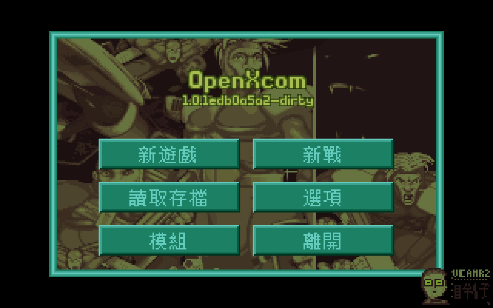
*主選單繁體中文化，右下角是「原來是個胖仔 / wicanr2」chibi pixel art 簽名*

### 致每一位老幽浮迷的一封信

還記得嗎？1994~1995 年代的某個深夜，房間裡只剩 CRT 螢幕的微藍光，14 吋螢幕跳出滿屏的「`UFOPAEDIA`」「`ALIEN SUB PEN`」「`MAGNETIC NAVIGATION`」⋯⋯ 你一邊翻著第三波那本薄薄的繁中手冊，一邊指揮一群叫不出名字的水兵潛入海底。那時候沒有 wiki、沒有 Discord，只有那本手冊，跟 BBS 留言板上互相討論留下的零碎攻略。

三十年過去了。

當年那群年輕人，早就變成了不同身分 — 變成了爸爸媽媽、變成了「下班還有力氣再開一場戰役」的中年玩家。多數時候只能在通勤的公車上、在小孩睡著的深夜十一點，偶爾回想起那些神作的片段。因為沒有時間，記憶就只能停在那個 14 吋 CRT 前面。

**這次有機會了。**

我翻出了塵封三十年的 1994 / 1995 第三波官方手冊，把當年阮建成、維京工作室翻譯的「**電漿**」「**水族人**」「**潛艇修理塢**」「**黃貂魚式飛彈**」這些譯名重新校對、復原、修補誤譯。連 **34 國士兵**的英文名都用 1990 年代聯合報國際版的音譯規範，一個個拼成中文 —「`Wang Wei`」變回「**王偉**」、「`Fernando Guedes`」變成「**費南多·古艾迪斯**」。OpenXcom 那些老問題 — 字型太小、Geoscape 時鐘「星期五」被切、UFOpaedia 文字色跟天空融成一片 — 也都修好了。

感謝這個 AI 時代，老遊戲終於有機會被認真中文化。整份 README、整套技術文件、上萬條翻譯校對、34 國音譯表，我都用 [Claude Code](https://claude.com/claude-code) 一輪一輪反覆編輯 — 希望這份漢化檔不只是「能玩」，而是一份 **30 年後給每一位老幽浮迷的回信**：那些深夜熬到三點才在賽多尼亞炸掉外星大腦的青春記憶，現在你可以用母語再玩一次了。

---

### 這是什麼專案

這是 **X-COM: UFO Defense（1994 MicroProse Julian Gollop）+ X-COM: Terror from the Deep（1995）** 的完整繁體中文化版本，基於開源重寫專案 [OpenXcom](https://github.com/OpenXcom/OpenXcom)。

| 項目 | 狀態 |
|------|------|
| common UI / 基礎介面 | **437 / 427 = 102%** |
| xcom1（UFO Defense 主線） | **1 101 / 1 075 = 102%**（含 UFOPEDIA 長段落） |
| **xcom2（TFTD 深海支線）** | **1 166 / 1 166 = 100%** ✨ v2.20 補完 |
| **34 國士兵名 CJK 全音譯 (v2.22)** | Phase A 6 + B 5 + **C 23 = 全 34 國 ~11000 entries** (Greek/Polynesia/Danish/Kenyan/Norwegian 等全部) |
| **Widget 切字 patches** | **10 個 source patch** — v2.21 (Purchase/Sell/Manufacture/Research/Funding/Basescape/MfgInfo) + **v2.22 (BaseInfo/MonthlyReport/GeoscapeCraft)** |
| **Mod 列表中文化 (v2.22)** | ModListState patch + 42 條 STR_MOD_xxx 翻譯，「外星人撿武器」「天神難度」「XcomUtil 永遠白天」等 |
| 字型 | WQY Zen Hei Sharp **12 px embedded bitmap**（Apache 2.0 / GPL） |
| Source patches | **5 個 `.cpp`**（Font / Options / Geoscape clock / UFOpedia 配色 / 簽名） |
| 平台 | Windows 10/11 64-bit + Linux x86_64 + WSL |
| GitHub | [wicanr2/openxcom-cht](https://github.com/wicanr2/openxcom-cht) |

接下來這份 README 大致分三層：上半第一句到「快速開始」是給只想玩遊戲的人看的（10 分鐘上手）；中段「為何要漢化」到 TFTD 八章是給願意陪我們重讀 1994/1995 譯本的老玩家看的（可以一邊泡茶一邊讀）；最後 Technical Deep Dive 起是給想自己 patch 或翻譯維護的工程師看的。各章節彼此獨立，從哪一段切進來都行。

---

<a name="quick-start"></a>
## ⚡ 快速開始

### 方式 0：整包獨立版（v2.20 雙作四包）

不必 build、不必裝 Steam、不必裝 runtime — **整包雙擊就跑**。

| 平台 | UFO（一代地表）| TFTD（二代深海）|
|---|---|---|
| **Windows 10/11 64-bit** | `OpenXcom-CHT-v2.29-UFO-portable.zip` 8.1 MB | `OpenXcom-CHT-v2.29-TFTD-portable.zip` 37 MB |
| **Linux x86_64** | `OpenXcom-CHT-v2.29-UFO-x86_64.AppImage` 16 MB | `OpenXcom-CHT-v2.29-TFTD-x86_64.AppImage` 45 MB |
| **macOS Universal**（arm64 + x86_64）| `OpenXcom-CHT-v2.29-UFO-universal.dmg` | `OpenXcom-CHT-v2.29-TFTD-universal.dmg` |

> 🍎 **Mac 版本說明**：DMG 是 Universal Binary（一個檔同時支援 Apple Silicon M1/M2/M3/M4 + Intel Mac）。GitHub Actions 自動 build（[`.github/workflows/build-mac-universal.yml`](.github/workflows/build-mac-universal.yml)），手動觸發或推 `v*-mac` tag 即啟動 — 因為 Mac .app 與 .dmg 需要 macOS host 製作（Apple SDK 限制），不能從 Windows 跨平台 build。下載方式：到 [Actions 頁面](https://github.com/wicanr2/openxcom-cht/actions/workflows/build-mac-universal.yml)抓 artifact，或從 [Releases](https://github.com/wicanr2/openxcom-cht/releases) 抓 tagged 版本。

**為何拆成 4 包？** 已知 OpenXcom 在 runtime 切換 mod (xcom1 ↔ xcom2) 會 crash — 每包只含一作對應遊戲資料 + 預設 active mod，避免使用者誤切。

**內含**：openxcom EXE + 全部 runtime（Win 20 個 DLL；Linux 57 個 .so）+ 翻譯資產 + 字型 + 對應原始遊戲資料（UFO 10 MB / TFTD 60 MB）+ portable launcher + 預設 zh-TW + 1280×800 設定。

Linux AppImage 走 XDG 路徑（`$XDG_DATA_HOME/openxcom-cht/` 與 `$XDG_CONFIG_HOME/openxcom-cht/`），不污染 OS。

> ⚠️ 整包版內含 X-COM 原版遊戲資料（10 MB），版權屬 MicroProse / 2K Games，**僅供已擁有正版 Steam X-COM 1 的玩家私人保存使用，不可公開散布**。本 GitHub repo 本身**不**提供整包下載，要自製請走方式 B + `tools/make_portable.ps1`。

### 方式 A：把翻譯資產 drop 進現成 OpenXcom

```bash
git clone https://github.com/wicanr2/openxcom-cht
cp -r openxcom-cht/bin/common/Language/*    /path/to/OpenXcom/data/common/Language/
cp    openxcom-cht/bin/standard/xcom1/Language/zh-TW.yml  /path/to/OpenXcom/data/standard/xcom1/Language/
cp    openxcom-cht/bin/standard/xcom2/Language/zh-TW.yml  /path/to/OpenXcom/data/standard/xcom2/Language/
# 在遊戲 Options > Language 切到 zh-TW
```

**注意**：方式 A 用 vanilla EXE，沒有 5 個 source patch，所以時鐘 widget 重疊、UFOpaedia 文字色等問題仍存在。要完整體驗請走方式 B。

### 方式 B：從 source 重 build（含全部 patch）

```bash
# Linux
git clone https://github.com/OpenXcom/OpenXcom /tmp/openxcom-src && cd /tmp/openxcom-src
cp /path/to/openxcom-cht/patches/src/**/*.{cpp,h} src/  # 5 patches
cp -r /path/to/openxcom-cht/bin/* bin/
mkdir build && cd build && cmake .. && make -j$(nproc)
```

```powershell
# Windows VS 2022 Build Tools
set CL=/utf-8    # 重要：cp950 系統避免 C2001
cmake --build build-win64-release --config Release
```

---

<a name="why"></a>
## ✨ 為何要漢化 X-COM？

「能玩」跟「為什麼值得再玩一次」是兩件事。前面那 30 行 Quick Start 解決前者。下面這段，是給願意停下來、想一下「**這個 1994 年的遊戲為什麼非繁中化不可**」的人看的。

1994 年，英國設計師 Julian Gollop 在 MicroProse 推出《**X-COM: UFO Defense**》。這款遊戲開創「**戰略+戰術雙層 RPG**」類型：玩家在 Geoscape 全球視角管理基地經濟、攔截 UFO；UFO 墜落後切換到 turn-based 戰術地圖，指揮 8-16 名特工執行回收任務。

1994 年，台灣**第三波文化**（Third Wave）出版了官方繁體中文版《幽浮１—地球防衛武力》遊戲手冊（46 頁）。譯者**阮建成**為這款遊戲建立了 200+ 條中文譯名的詞彙基礎：**幽浮、攔截機、運兵機、雪崩式飛彈、電漿、心靈、收容所、指揮官**……這些詞 30 年後仍是繁中圈通用譯名。

但官方手冊只覆蓋「英文速查表」(p.1-15)，遊戲內介面、UFOPEDIA 全文、外星人物種名、TFTD 海底支線等核心內容，1994 年的玩家只能憑英文硬玩。

**三十年後，這個專案想做的事**：

修正 OpenXcom 繁中字身擠在一起的排版問題，讓 2026 年的中文玩家以母語讀到攔截機派遣指令、UFO 墜落地點報告、外星人解剖筆記，以及那句經典台詞——「**指揮官，我們的研究員找到一些有趣的東西⋯⋯**」

> 「**指揮官**，X-COM 計畫的成敗，就交給您了。地球的命運懸於一線。」  
> — 1994 X-COM 開場字幕（繁中譯本）

---

<a name="xcom-history"></a>
## 📜 X-COM 戰史 — 從 1994 到 OpenXcom

要講譯名為什麼這樣選、為什麼某些詞 30 年不能換，得先把時間線拉開來看。X-COM 不是一款遊戲，是一個跨越 32 年、橫跨四個時代的 IP 史 — 從 1994 年 MicroProse 的 turn-based 戰術原作，到 2009 年葡萄牙工程師 SupSuper 在自家臥室從零開始寫的開源重製，再到 2012 年 Firaxis 的 3D 重啟。每一個世代都留下了不同的譯名遺產，**而本專案站的就是 1994/1995 第三波官方手冊那一條線**。

### 第一紀：Gollop 三部曲（1994–1997）

| 年份 | 作品 | 主題 |
|------|------|------|
| **1994** | **X-COM: UFO Defense** | 地表戰爭：攔截 UFO、地面戰鬥、研究/生產／火星 Cydonia 終局 |
| 1995 | X-COM: Terror from the Deep（TFTD） | 海底戰爭：海面/水下雙艙、深海種族對抗 |
| 1997 | X-COM: Apocalypse | 城邦戰爭：實時戰術 + 多公司政治 |

三作主題遞進：**地球**（地表）→ **海洋**（深海）→ **城市**（後現代）。Gollop 用一個 IP 涵蓋三種「人類視角下的他者入侵」。1995 年那本《電腦玩家》TFTD 專題其實已經預告過 1997 Apocalypse 的「即時戰術 + 多公司政治」設定，當時編輯部的論調是「Gollop 在重新定義整個系列」。可惜的是 1997 上市時 X-COM 系列在西方的熱度已經被 Diablo 與 Quake II 搶光，台灣這邊《電腦玩家》Apocalypse 試玩短評只有不到兩頁——**所以三部曲裡，繁中圈真正記得的只有前兩作**。本專案聚焦 1994 + 1995 兩作，原因不只是技術上 OpenXcom 重寫覆蓋這兩作，更是繁中玩家共同記憶的承載點就在這兩部。

### 第二紀：商業沉寂（1998–2008）

MicroProse 被 Hasbro 收購、X-COM 系列暫停。1994 第三波官方手冊絕版，繁中玩家面臨「有遊戲但沒有官方支援」的十年空窗。光華商場二樓那幾家二手遊戲店裡，那盒《幽浮１》紅色外盒從 NT$590 慢慢漲到 NT$1200、再變成「絕版收藏品」標價 NT$2500，最後完全絕跡——這段時間繁中圈唯一還能玩到 X-COM 的方式，就是去找 1990 年代刻的私人光碟拷貝，配上一台還能跑 Windows 98 的 PC。BBS UFO-FANS 板在 2002-2005 年間還偶有貼文，多半是「**有人記得當年那本第三波手冊在哪嗎？**」的徵求文。

### 第三紀：開源重寫（2009–）

2009 年葡萄牙工程師 **SupSuper** 發起 [OpenXcom](https://github.com/OpenXcom/OpenXcom) 計畫：用 C++ 從零重寫 1994 原作邏輯，支援高解析度、模組系統、多平台。2014 年 OpenXcom 1.0 正式版發佈。2017 年衍生 [OpenXcom Extended (OXCE)](https://github.com/MeridianOXC/OpenXcom)，加入 hi-res mod / 進階戰術選項。

SupSuper 這個專案的存在本身就是奇蹟。一個一個人、十六年、把 1994 那套 MS-DOS Watcom C++ 原始碼從零用現代 C++ 重新寫一遍，**而且還對齊到原版逐個像素相同的程度**。台灣這邊很多老玩家是 2020 年前後才透過 Steam X-COM 原版 + OpenXcom 包這條路徑重新接觸到這款遊戲——你裝 Steam 那 NT$60 不到的 X-COM Collection，再把資料 dump 到 OpenXcom 目錄，瞬間就有了 1440×900 全螢幕、可用滑鼠滾輪、不會崩潰的 1994 體驗。**但繁中翻譯這一塊，從 OpenXcom 上游到我們這個專案之間，整整等了 15 年才有人補完**。

**本專案基於 vanilla OpenXcom**，commit `1edb0a5a`（2024-2025 era master），目標是「**最小侵入 + 1994 第三波譯名傳承 + 現代視覺修正**」。

### 第四紀：2012 Firaxis 重啟（番外）

2012 年 Firaxis Games 推出《XCOM: Enemy Unknown》3D 重啟，2016 年續作《XCOM 2》。**現代版與 1994 原作邏輯/UI/平衡完全不同，本專案不涉及 Firaxis 版本**。

---

<a name="campaign-flow"></a>
## 🎯 戰役流程 — 太空監視到火星終局

X-COM 是一款**戰略+戰術雙層**遊戲。一次完整戰役通常持續 **遊戲內 6-12 個月**（玩家實時約 40-80 小時）。

```
┌─────────────────────────────────────────────────────────────┐
│  Geoscape（地球視角）— 戰略層                                │
│  ├── 雷達偵測 UFO                                            │
│  ├── 派攔截機追擊                                            │
│  ├── 16 國月補助 → 收入                                       │
│  └── UFO 墜落／降落 → 進入戰術層                              │
└───────────────────┬─────────────────────────────────────────┘
                    │
        ┌───────────▼───────────┐
        │  攔截戰（dogfight）    │  飛彈/光束對 UFO 護甲
        │  60 秒內擊落或撤退      │
        └───────────┬───────────┘
                    │
        ┌───────────▼─────────────────────────────────────────┐
        │  Battlescape（戰術層）— 8-26 名特工 turn-based      │
        │  ├── 探索墜落點 / 城市恐怖任務 / UFO 基地            │
        │  ├── 回收外星武器、屍體、活俘                        │
        │  └── 撤離 → 結算                                     │
        └───────────┬─────────────────────────────────────────┘
                    │
        ┌───────────▼─────────────────────────────────────────┐
        │  Basescape（基地管理）                              │
        │  ├── 實驗室：研究外星科技                            │
        │  ├── 工作室：生產武器                                │
        │  ├── 收容所：審訊活俘 → 解鎖科技樹                   │
        │  └── 機庫：補充攔截機 / 運兵機                       │
        └───────────┬─────────────────────────────────────────┘
                    │
              （循環回 Geoscape）
                    │
                    ▼
        ┌────────────────────────────────────────┐
        │  終局：突襲火星 Cydonia / 賽多尼亞      │
        │  兩階段戰：火星表面 → 外星人大腦核心    │
        └────────────────────────────────────────┘
```

每個月底 16 國理事會評分。連續兩月評分過低 → 國家退出資助 → 收入崩潰 → Game Over。

> 「**幽浮並不是個英文訊息很多的遊戲**，在一般操作畫面中，甚至見不到多少單字。」  
> — 第三波《幽浮１》手冊開場白

---

<a name="ranks"></a>
## 🎖️ 兵種與軍階 — 從菜鳥到指揮官

X-COM 特工從 **新兵（ROOKIE）** 起步，戰場表現累積經驗，自動晉升六階軍階。1994 年玩家最深刻的記憶之一，就是看著一個原本反應只有 30、射擊準確度 45、第一次出任務拿手槍就被腦蟲心靈搶過去打自己人的 ROOKIE，**經過六、七個月戰場磨練，竟然升到 COMMANDER，全螢幕只有他一個指揮官**。X-COM 的軍階體系不是裝飾——指揮官在場可以提升全隊勇氣值、抗驚恐、提供 M.C. 偵測，**而且整個 X-COM 部隊全球同時只能有一個 COMMANDER**。死了就再也不會自動晉升出來，你必須苦練下一個老兵到上校再等運氣。1995 年第三波那批玩家在 BBS 上有個傳說：「**指揮官陣亡的存檔，請不要讀回來——他的家人正在等他回家**」。

| 英文 | 1994 第三波 | 本專案 | 角色定位 |
|---|---|---|---|
| ROOKIE | 新兵、見習生、菜鳥 | **新兵** | 起始職等，反應差、易死 |
| SQUADDIE | 班兵 | **下士** | 第一次晉升 |
| SERGEANT | 士官 | **中士** | 統帥小隊 |
| CAPTAIN | 尉官 | **上尉** | 中階軍官 |
| COLONEL | 校官 | **上校** | 高階軍官 |
| COMMANDER | 指揮官 | **指揮官** | 全戰場最高指揮，**僅一人** |

> **歷史差異**：1994 第三波採「兵 / 士官 / 尉官 / 校官」中華軍制體系；本專案依 OpenXcom 社群慣例採「下士 / 中士 / 上尉 / 上校」精確對應。兩者皆通，現行更精準。

阮建成 1994 那套「兵 / 士官 / 尉官 / 校官」的選擇其實非常有時代感——他是用**中華民國國軍兵科分類體系**直接對應英文軍階，這是 1990 年代台灣讀過國中軍訓課的人最熟悉的分類方式。**問題在於 OpenXcom 出生在 2009 年的歐洲社群、用的是 NATO 軍階體系（Squaddie → Corporal → Sergeant → Captain → Colonel → Commander）**，「下士 / 中士 / 上尉 / 上校」直接對應 NATO 階級，每個玩家從 Steam 拿到 X-COM 上手都能秒懂。我們本專案選了後者，但**不批判 1994 譯本**——那是兩個時代、兩套讀者預期的合理選擇。如果哪天有人想做「1994 復古譯名包」把軍階全換回「兵 / 士官 / 尉官 / 校官」，我們會樂見其成。

### 戰士屬性（X-COM 6 大數值）

| 英文 | 1994 | 本專案 | 影響 |
|---|---|---|---|
| HEALTH | 健康 | **健康值** | HP，受傷消耗 |
| STAMINA | 活力 | **體力** | 衝刺/疾跑可用 TU |
| BRAVERY | 勇氣 | **勇氣** | 抗驚恐/狂暴 |
| REACTIONS | 反應度 | **反應** | 自動射擊觸發概率 |
| FIRING ACC | ACC | **射擊命中** | 命中率 |
| STRENGTH | 力 | **力量** | 負重 + 投擲距 |

外加 **TIME UNITS（行動點）**，每回合可動點數。

---

<a name="weapons"></a>
## 🔫 武器階層 — 來福槍到電漿光束

X-COM 武器分**三代**，研究外星屍體與裝備後逐層解鎖。1994 年那本第三波手冊裡列武器只用一頁，**但這一頁卻是當年玩家翻最爛的一頁**——因為遊戲不會告訴你「重型雷射要先研究 LASER WEAPONS」「電漿步槍需要捕獲活體外星人」這些科技樹條件，全靠玩家自己在 BBS 上互相問。打個比方：你第一次拿到電漿步槍那一刻——大概是開戰第 4 個月、突襲外星基地拿回的——**你會記一輩子**。從那個月起所有的雷射步槍突然變成廢物，工作室開始量產電漿，整個戰術節奏被翻過一面。

### 第一代：地球工業武器（起始裝備）

開局每個新兵發一把來福槍 + 一顆手榴彈，這就是你的全部家當。1994 年玩家最有共同記憶的時刻之一，就是發現「**手槍對 SECTOID 反而比來福槍實用**」——因為手槍 TU 消耗少、可以一回合連打三發。重型加農炮（HEAVY CANNON）有三種彈藥（HE / AP / I），早期火力支援之神；火箭發射器（ROCKET LAUNCHER）打不準但拖出來就嚇人。台灣老玩家對火箭發射器的記憶是「**一發誤射可以炸死自己三個隊友**」——這不是誇張，是 1995 年《電腦玩家》某期讀者投書真的這麼寫的。

| 英文 | 1994 第三波 | 本專案 |
|---|---|---|
| PISTOL | 手槍 | **手槍** |
| RIFLE | **來福槍** | 步槍 |
| HEAVY CANNON | 重砲（重 + 砲）| **重型加農炮** |
| AUTO CANNON | 自動砲 | **自動加農炮** |
| GRENADE | 手榴彈 | **手榴彈** |
| SMOKE GRENADE | 煙幕彈 | **煙霧彈** |
| HIGH EXPLOSIVE | 爆炸性 | **高爆炸藥** |
| ROCKET LAUNCHER | 火箭發射器 | **火箭發射器** |

### 第二代：雷射科技（研究 LASER WEAPONS 後解鎖）

雷射武器不需彈藥，但前期研究成本高、後期被電漿淘汰。

| 英文 | 譯名 |
|---|---|
| LASER PISTOL | 雷射手槍 |
| LASER RIFLE | 雷射步槍（1994: 雷射來福） |
| HEAVY LASER | 重型雷射 |

### 第三代：電漿科技（捕獲外星活體後解鎖）

| 英文 | 譯名 |
|---|---|
| PLASMA PISTOL | 電漿手槍 |
| PLASMA RIFLE | 電漿步槍 |
| HEAVY PLASMA | 重型電漿 |
| **PLASMA** | **電漿** ✓ 1994 與本專案同 — 32 年來繁中圈一致 |

### 飛彈系統（攔截機武裝）

| 英文 | 1994 第三波 | 本專案 | 備註 |
|---|---|---|---|
| STINGRAY | **黃貂魚式飛彈** | 刺尾 | ⚠️ 1994 譯名正確（魟魚），本專案誤譯待修 |
| AVALANCHE | 崩雪式飛彈 | **雪崩** | 雙方皆通 |
| CANNON | 砲 | **加農炮 / 機炮** | 字型限制改「炮」字 |
| FUSION BALL | 融合彈 | **融合彈** | 終極外星武器 |

STINGRAY 這條譯名公案值得單獨講一下。1994 阮建成那年譯「**黃貂魚式飛彈**」——STINGRAY 在動物學上就是黃貂魚（俗稱魟魚），這個譯名 100% 正確。但本專案早期 v2.x 不知道為什麼譯成「刺尾」——刺尾屬於熱帶魚類俗稱，跟 STINGRAY 完全是兩種生物，**這是本專案目前最大的譯名 bug，已列入 v2.27+ 修正候選**。AVALANCHE「雪崩」雙方都通，1994 譯「崩雪式飛彈」帶日式軍武片名感（崩雪 = 雪崩日譯），現代直接「雪崩」反而更利索。

完整 200+ 條譯名對照見 [`docs/GLOSSARY_1994_MANUAL.md`](docs/GLOSSARY_1994_MANUAL.md)。

---

<a name="aliens"></a>
## 👽 外星人圖鑑 — 七種族與恐怖單位

X-COM 一代的七大智慧種族，是繁中圈 1990s B 級科幻 + 軍事入侵想像的集大成。**SECTOID** 灰皮膚小腦袋直接從 1947 年羅斯威爾事件外星灰人原型搬過來，**SNAKEMAN** 蜿蜒爬行的設計是 1980s D&D 蛇人怪物與《V 星際大戰》的合體，**MUTON** 重甲近戰的人形怪物源自《異形》與《終極戰士》混血——MicroProse 1994 在這個 IP 裡塞進了戰後西方科幻 50 年的 collective unconscious。1994 年那本第三波手冊提到外星種族時非常克制，只給軍階對照，沒有詳細種族描述——**所以當年 BBS UFO-FANS 板最熱門的話題就是「你怎麼知道 ETHEREAL 是強種？」**「ETHEREAL 是誰？」這種問題反覆出現，直到 90 年代末才有人系統性地把 UFOPEDIA 全文翻譯成中文。

### 七大智慧種族

每個種族都有「士兵 / 領航員 / 工程師 / 醫療兵 / 領袖 / 指揮官」六個軍階（部分種族缺工程師或領導）。捕獲對應軍階解鎖不同科技樹。

| 英文 | 譯名 | 特性 |
|---|---|---|
| SECTOID | **腦蟲** | 灰色小型外星人，心靈攻擊 |
| FLOATER | **浮游者** | 浮空種族，輕甲 |
| SNAKEMAN | **蛇人** | 蜿蜒爬行，戰鬥力高 |
| MUTON | **巨型怪** | 重甲近戰 |
| ETHEREAL | **靈體** | 全種族最強心靈，肉身脆弱 |
| CELATID | **盲蟲** | 化學噴吐 |
| SILACOID | **矽生物** | 移動的火焰 |

### 恐怖單位（無領袖階層的戰場生物）

| 英文 | 譯名 | 屬於 |
|---|---|---|
| CHRYSSALID | **蟹形蟲** | 蛇人 — 一擊變屍體 + 生出新蟹蟲 |
| ZOMBIE | **喪屍** | 蟹蟲攻擊副產物 |
| REAPER | **收割者** | 浮游者 — 雙顎重型生物 |
| CYBERDISC | **電腦碟** | 腦蟲 — 自動化飛碟 |
| SECTOPOD | **腦機甲** | 靈體 — 強雷射機械生物 |

**蟹形蟲（CHRYSSALID）是整個 1994 X-COM 最讓老玩家睡不著覺的東西**。它的設定是「碰你一下，你就死了；你的屍體 30 秒後變成喪屍走過來打你的隊友；你的隊友死了之後，從他身體爆出來的不是屍體而是一隻新的蟹形蟲」——這個遞迴傳染機制在 1994 turn-based 遊戲裡是革命性的。第一次玩到城市恐怖任務碰到蟹蟲群的玩家有兩種反應：一種是當場關機從此戒掉 X-COM，另一種是花一個月研究出火箭發射器跟它拼。**1995 年第三波 BBS 有個著名的玩家發言：「**我看到蟹蟲在我家附近的港口出現的瞬間，我關掉電腦三天沒開**」**——這就是當年的心理陰影。本專案 CHRYSSALID 譯「蟹形蟲」其實有點妥協（社群慣例是「異形蜥」也有人提過），但「蟹」字準確抓住了那個甲殼質感與兩支大鉗的視覺。

> 1994 第三波手冊未提供種族專名（因英文原版本身畫面不顯式命名），本專案譯名為**社群慣例 + 字形相容性**考量。

完整外星科技樹（UFOPEDIA）見遊戲內 UFOPAEDIA > ALIEN LIFE FORMS。

---

<a name="geography"></a>
## 🌍 世界地理 — 五大洲與基地選址

X-COM 把地球分**五大洲 + 16 個國家**，每月每國根據你的表現提供補助金。1994 那本第三波手冊把這 16 個國家排了個列表，當年玩家盯著這頁看的時間，**比看軍階表還久**——因為基地選址這件事，是 X-COM 全戰役最早做、影響最深的決策。第一個基地建在哪裡，決定了你前 3 個月雷達能不能涵蓋足夠的 UFO 活動區、決定了你受到首次城市恐怖任務的反應時間、甚至決定了某些 UFO 殘骸你打不打得到（運兵機航程有限）。1995 年《電腦玩家》專題有過一個玩家投書，他把選址的故事寫得跟移民史一樣感人——「**我這次戰役想試把基地建在台灣**，雷達畫一圈剛好涵蓋東南亞、日本與中國沿海，這就是我的家」。X-COM 在那個時代是少數讓玩家有「**為地球選一個家**」這種儀式感的遊戲。

### 五大洲補助結構

| 英文 | 1994 第三波 | 本專案 | 初始月補助 |
|---|---|---|---|
| AMERICA / USA | 美洲 / 美國 | **美洲 / 美國** | $850 K |
| EUROPE | 歐洲 | **歐洲** | $800 K |
| ASIA | 亞洲 | **亞洲** | $700 K |
| AFRICA | 非洲 | **非洲** | $400 K |
| AUSTRALASIA | **大洋洲（含澳洲）** | **大洋洲** | $400 K |

### 16 個資助國（依手冊順序）

USA、UK、FRANCE、GERMANY、ITALY、SPAIN、RUSSIA、JAPAN、CHINA、INDIA、CANADA、BRAZIL、EGYPT、NIGERIA、SOUTH AFRICA、AUSTRALIA。

### 基地選址策略（1994 手冊未明寫，社群經驗）

| 區域 | 優勢 | 劣勢 |
|---|---|---|
| 北美中部（USA 中央）| 雷達覆蓋 USA + 加拿大 | UFO 大西洋繞道 |
| 歐洲（德法交界）| 涵蓋歐洲補助大戶 | 西伯利亞 UFO 接近遲 |
| 中東（埃及/沙烏地）| 雷達覆蓋三洲 | 補助較低 |
| 東南亞（菲律賓附近）| 太平洋 UFO 攔截 | 遠離歐美 |
| **南極（ANTARCTICA）** | 無國家收入 | 戰略樞紐，後期需要 |

南極基地是 X-COM 全戰役最有故事感的選址。中期之後 UFO 開始大量出現於南半球（澳洲、南非外海、南極圈邊緣），這時候你會想在南極建第二或第三基地。**南極基地不靠補助金（沒國家），純粹當作雷達哨站 + UFO 攔截中繼**——維持這個基地的錢全靠你打 UFO 拿回的外星合金跟 Elerium-115 變現。1994 年那個年代的玩家很喜歡這種「**自給自足的邊境前哨**」感覺，像在地球的盡頭蓋一座屬於 X-COM 自己的城堡。

> 1994 手冊把澳洲歸「大洋洲(含澳洲)」— 這是 1990 年代台灣地理教科書術語，跟本專案的「**大洋洲**」沿用。

---

<a name="widget-clip"></a>
## 🔧 v2.21+v2.22 — Widget 字身切底修復（10 個 patch）

> 玩家原始抱怨：採購畫面「目前資金: $4,138,000」中「**金**」顯示為「**余**」（底部 4 px 被切）。

### v2.22 補完（v2.21 7 patches 之上再加 3）

| # | 檔案 | 改法 |
|---|---|---|
| 8 | `Basescape/BaseInfoState.cpp` | **26 widgets** 連動，h 9→11 + 行距 11→13 + 6 個 `_bar*` y 同步 |
| 9 | `Geoscape/MonthlyReportState.cpp` | 5 header + `_txtDesc` h 132→117，行距 8→13 重排 |
| 10 | `Geoscape/GeoscapeCraftState.cpp` | 12 widgets，行距 8→10 整段重排 |

### v2.21 7 patches（已 ship）

> 玩家原始抱怨：採購畫面「目前資金: $4,138,000」中「**金**」顯示為「**余**」（底部 4 px 被切）

### 根因

OpenXcom 多數 widget 寫死 `new Text(W, 9, X, Y)`，假設 ASCII 9 px 字身。CJK 12 px 字身被 SDL `setClipRect(0, 0, w, 9)` 切到底 3-4 px。「金/購/間/職/師/配/品」等帶下半部結構的字最受傷。

之前 v2.14 只修 Geoscape 時鐘 widget；v2.21 補上 **7 個高頻畫面** 的同類 patch。

### 修復清單

| # | 檔案 | Widgets | 改法 |
|---|---|---|---|
| 1 | `Basescape/BasescapeState.cpp` | 2 (`_txtLocation`, `_txtFunds`) | h 9→13, y -2 — **用戶原始抱怨點** |
| 2 | `Geoscape/FundingState.cpp` | 3 header + list y shift | h 9→13, y -2, `_lstCountries` y 40→44 |
| 3 | `Basescape/ManufactureInfoState.cpp` | 3 widgets | h 9→13, y -2 |
| 4 | `Basescape/PurchaseState.cpp` | 3 widgets | **h 9→11 折衷**（下方 `_cbxCategory` 擠不下 13）|
| 5 | `Basescape/SellState.cpp` | 6 widgets | h 9→13, `_lstItems` y 54→58 |
| 6 | `Basescape/ManufactureState.cpp` | 5 widgets + row3 下移 | h 9→13, row3 整段 y +2 |
| 7 | `Basescape/ResearchState.cpp` | 4 widgets + row3 下移 | h 9→13, row3 整段 y +2 |

完整 audit 推導見 [`docs/widget_clip_audit.md`](docs/widget_clip_audit.md)。v2.21 實作 deviation 見 [`docs/widget_patches_v221.md`](docs/widget_patches_v221.md)。v2.22 高風險 reflow 決策見 [`docs/widget_patches_v222.md`](docs/widget_patches_v222.md)。

---

<a name="mod-i18n"></a>
## 🧩 v2.22 — Mod 列表中文化

> 玩家進「模組」畫面看到一長串英文 mod 名（`Aliens_Pick_Up_Weapons` / `Demigod_Difficulty` / `XcomUtil_Always_Daytime` ...）

### 解法

`ModListState.cpp` 加 `STR_MOD_<id>` lookup + fallback：

```cpp
// 找不到 STR_MOD_<id> 則 fallback 回 mod metadata.yml 的原文 name
std::string key = "STR_MOD_" + modInfo->getId();
LocalizedText loc = _game->getLanguage()->getString(key);
return (loc.str() == key) ? modInfo->getName() : loc.str();
```

42 條翻譯 keys append 到 `bin/common/Language/zh-TW.yml`：

| 英文 mod id | 中文顯示 |
|---|---|
| `xcom1` | X-COM 一代：地球防衛武力 |
| `xcom2` | X-COM 二代：深海出擊 |
| `Aliens_Pick_Up_Weapons` | 外星人撿武器 |
| `Demigod_Difficulty` | 天神難度 |
| `XcomUtil_Always_Daytime` | XcomUtil 永遠白天 |
| `UFOextender_Psionic_Line_Of_Fire` | UFOextender 心靈視線檢查 |
| ... | (共 42 條) |

**設計決策**：`UFOextender` / `XcomUtil` / `StrategyCore` 等社群工具集名**不譯**（保英文比強譯清楚）；vehicle/location 走中文慣用 (Skyranger→運兵機、Triton→海神號、Cydonia→賽多尼亞)。詳見 [`docs/mod_i18n_v222.md`](docs/mod_i18n_v222.md)。

---

<a name="tftd"></a>
## 🌊 深海戰場 — TFTD 二代漢化（v2.20 新增）

> 「2040 年 1 月 1 日。深海中傳來不明信號⋯⋯」

繼一代《幽浮：地球防衛武力》ship 後，v2.20 補完《幽浮：深海出擊》(*X-COM: Terror from the Deep*, 1995) 的完整繁體中文化。

### TFTD 設定與核心差異（vs 一代）

| | UFO (1994) | TFTD (1995) |
|---|---|---|
| 時間 | 1999 年 | 2040 年（一代結束 40 年後）|
| 戰場 | 地表 + 大氣層 | 海面 + 深海 |
| 玩家組織 | X-COM | X-COM 海軍分部 |
| 載具 | 攔截機 / 運兵機 | 海神號 / 曼塔號 / 槌鯊號（潛艇）|
| 武器系 | 雷射 → 電漿 | 高斯 → 音波（**SONIC ≠ 音速** — 1995「音速」物理誤譯、台灣慣用「音波」）|
| 動能 | Elerium-115 | Z 元素（Zrbite，深海版稀有元素）|
| 終局 | 火星 Cydonia | 海底古城 T'leth（賽爾斯）|

### TFTD 種族圖鑑

**七大智慧種族**（1995 手冊只列 2 個 — Aquatoid / Gillman，其餘為社群慣例）：

| 英文 | 1995 第三波 | 本專案 | 備註 |
|---|---|---|---|
| AQUATOID | **水族人** | 水生人 | ⚠️ 1995 較佳，v2.21 候選改回 |
| GILLMAN | **鰓型人** | 鰓型人 | ✓ 沿用 1995 |
| LOBSTERMAN | — | 龍蝦人 | 社群慣例 |
| TASOTH | — | 塔索斯 | 社群慣例 |
| BIO-DRONE | — | 生物無人機 | 社群慣例 |
| TENTACULAT | **觸鬚人** | 觸手怪 | 1995 較貼洛夫克拉夫特氛圍，v2.21 候選 |
| CALCINITE | **石灰人** ❌ | **鈣化體** ✓ | 1995 化學不精準（CaO ≠ CALCIN-），現行正確 |
| DEEP ONE | **深海一號** ❌ | **深淵者** ✓ | 1995 誤譯（洛夫克拉夫特典故，非編號），現行正確 |

**恐怖戰場單位**：三角龍 (Triscene) / 幻象生物 (Hallucinoid) / 薩奎 (Xarquid)

### 1995 第三波獨家妙譯（本專案已採納）

| 英文 | 1995 第三波 | 原因 |
|---|---|---|
| **ALIEN SUB PEN** | 潛艇修理塢 | penitentiary（監獄）+ pen（圍欄）雙關，1995 精準翻譯 |
| **THERMAL TAZER** | (未列) | THERMAL=熱，現行修正為「**熱能電擊棒**」(舊版誤譯「冷凍電擊棒」反向) |

完整 80+ 條 TFTD 譯名對照 + 5 條「不要回退」警告見 [`docs/GLOSSARY_1995_TFTD_MANUAL.md`](docs/GLOSSARY_1995_TFTD_MANUAL.md)。原始 1995 手冊 PDF 收錄於 [`docs/DDSC-J-00121-遊戲手冊：幽浮２－深海出擊.pdf`](docs/)（53 頁，34.9 MB）。

### TFTD 截圖（7 張實機展示）

| TFTD 主選單（含簽名）| 難度選擇（5 級全中文）|
|---|---|
| 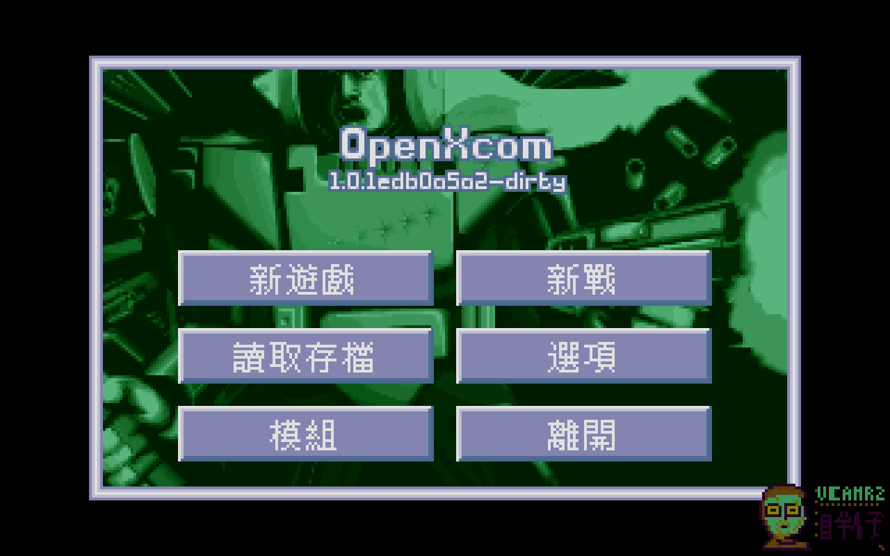 | 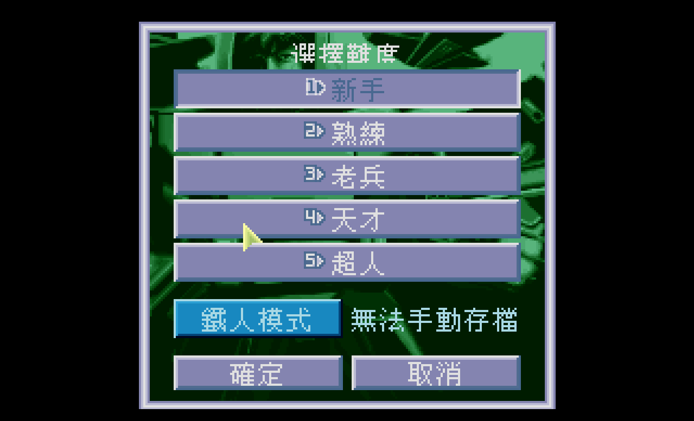 |
| *綠色 TFTD 風格主選單，右下角 chibi 簽名共用* | *新手 / 熟練 / 老兵 / 天才 / 超人 + 鐵人模式 + 無法手動存檔* |

| Geoscape 2040/1/1 | 海底基地放置驗證 |
|---|---|
| 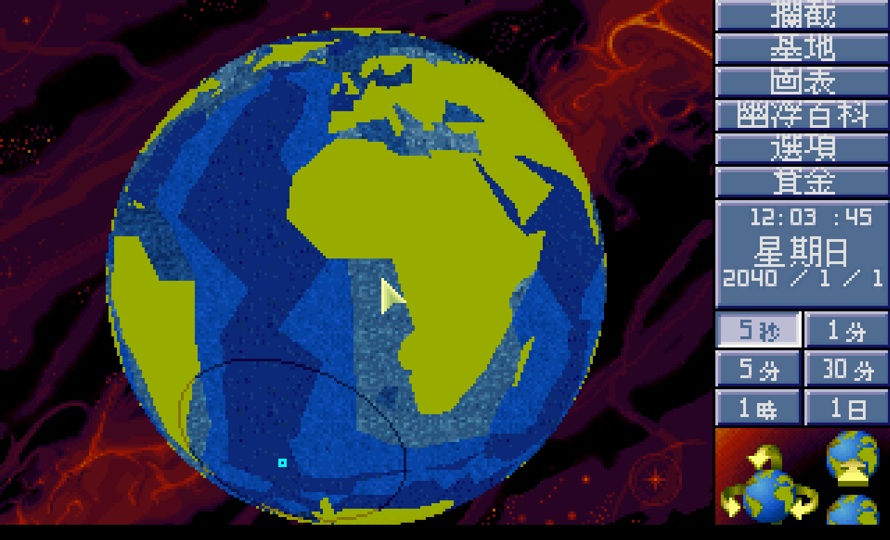 | 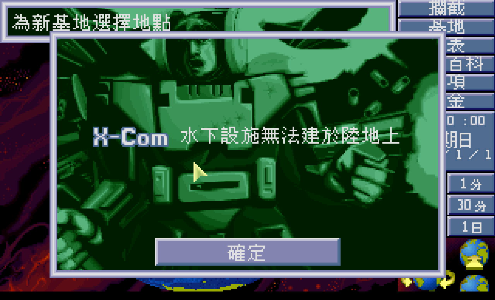 |
| *2040 年深海戰役起點，全中文 Geoscape* | *TFTD 獨有提示：「X-Com 水下設施無法建於陸地上」（中文化驗證點）* |

| 基地名稱輸入 | Basescape 11 中文選項 |
|---|---|
| 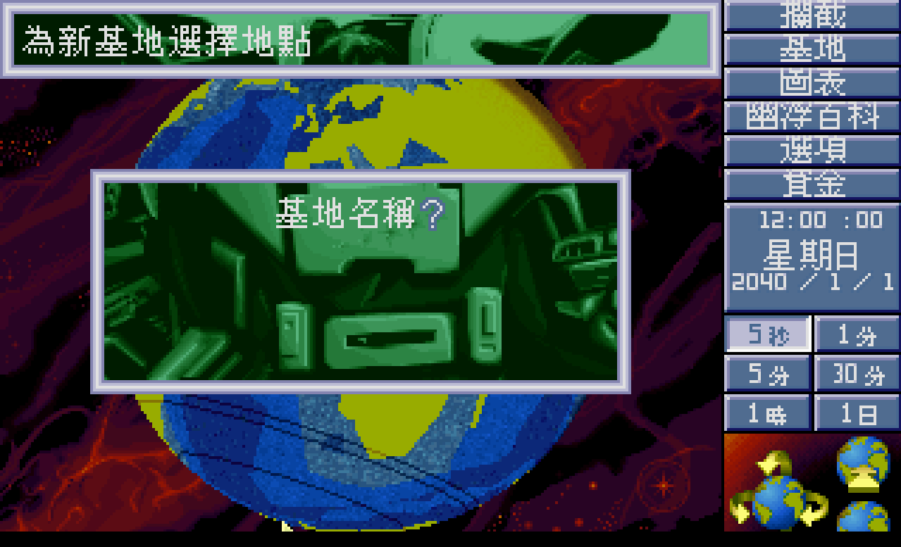 | 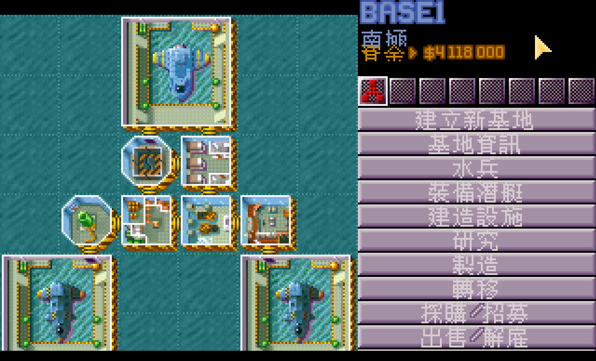 |
| *「基地名稱？」對話框 + 海床背景* | *建立新基地 / 基地資訊 / 水兵 / 裝備潛艇 / 建造設施 / 研究 / 製造 / 轉移 / 採購招募 / 出售解雇* |

| Base Info — 1995 妙譯實機驗證 |
|---|
| 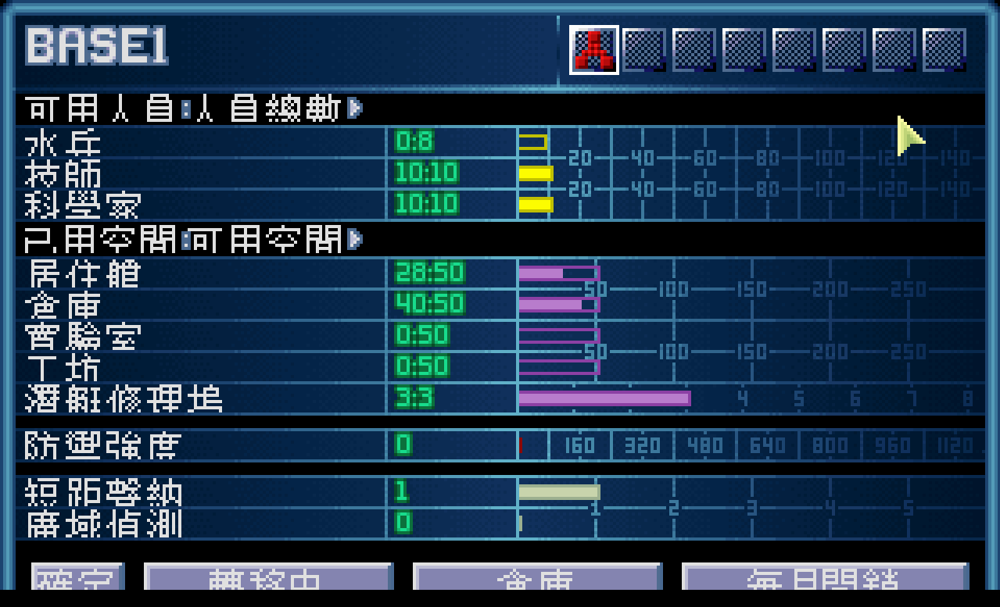 |
| *側欄顯示「**潛艇修理塢**」(Alien Sub Pen, penitentiary 雙關) — 1995 第三波官方手冊獨家妙譯，本專案 v2.20 採納* |

---

<a name="tftd-origin"></a>
## 🛥️ TFTD 戰役起源 — 2040 年的深海警訊

> 「火星：賽多尼亞的崩落。凱旋的 X-Com 摧毀了外星戰爭機器的核心，正升空返航。然而，這座荒廢的火星基地內，並非萬物俱寂⋯⋯」
> — `STR_INTRO_2/3`（1995 TFTD 開場字幕，繁中譯本）

想像一下，1999 年的聖誕節前夕，你的部隊在火星賽多尼亞核心引爆了 Elerium-115 反應堆。畫面上，外星戰爭機器的圓頂塌陷成一片橘紅色火球。任務簡報音樂收尾。你以為這就是結局了——畢竟過去 12 個月你打了 80 個小時，從帶著卡賓槍的菜鳥水兵打到全身合金裝甲的指揮官，第三波那本《幽浮１》手冊都翻到書脊裂開。**這時候誰會想到，運兵機剛離開火星地表那一瞬間，鏡頭會切到一道紫色的迅子束從廢墟中竄出，劃過行星之間的虛空，直直射向地球？**

那道光束擊中的，是一具沉眠 **6500 萬年** 的深海接收器。它屬於一座龐大的外星都會 **賽爾斯** (T'leth)，其核心臥躺著一位「**偉大夢者**」——一位被囚禁於本星球達白堊紀生物大滅絕之前的太空之神。1995 年的玩家當年看到這段 cutscene 時，BBS 上的 X-COM 板鬧翻天：到底 Cydonia 在火星發出的訊號和地球的深海有什麼關係？洛夫克拉夫特那個《Dagon》的影子怎麼跑進 MicroProse 的軍事題材了？這就是 TFTD 最讓老幽浮迷崩潰、也最讓人著迷的地方——**它把一代的 Cold War 軍事公文體，硬是接上了不可名狀的宇宙恐怖**。

| 紀年 | 大事記 |
|---|---|
| 西元前 6500 萬年 | 賽爾斯被囚於墨西哥灣深海，與恐龍同沒入冰冷的歷史 |
| 1999 年 | X-Com 在火星擊毀外星戰爭機器，但火星發出迅子束喚醒賽爾斯 |
| **2000–2039 年（空窗 41 年）** | X-Com 因冷戰結束、聯合國裁軍而解散；外星人於深淵悄悄重建艦隊 |
| **2040 年 1 月 1 日** | 跨大西洋客輪 **海皮里恩號** 在大西洋遭音波襲擊 — X-Com 重啟，這次由 **海軍部** 統籌 |
| 2040 年 Q1 | 各國恢復補助；**水兵** (Aquanauts) 部隊組建，**梭魚 01** 首航 |
| 2040 年中段 | 偵測 USO（**水下不明物體**）墜艦；高斯科技解鎖；鰓型人活體研究 |
| 2040 年末 | 賽爾斯自海床冉冉升起，發動全球瘟疫與洪水威脅 |
| 終局 | 突襲賽爾斯三層內部，**摧毀 8 條能量管線** 終結偉大夢者 |

中間整整空了 41 年。這 41 年，地球以為自己贏了——冷戰結束、聯合國裁軍、各國把預算砍光，X-Com 部隊解散、水兵改業、雷達站變廢墟。而外星人在深海下面悄悄打造艦隊。**這一段時間差，是 TFTD 全劇本最殘酷的設計**：當 2040 年元旦海皮里恩號的求救訊號傳來時，地球海防是赤裸的。

### 序曲的台詞

開場那段無線電對話，1995 第三波譯本（本專案 v2.20 沿用 + 文體再潤色）是這樣寫的：

> 「**求救！求救！這裡是跨大西洋客輪海皮里恩號。我們正遭受攻擊⋯⋯**」
> 「**指揮中心呼叫一號潛艇庫：開啟海門。派出梭魚 01——我們遭遇外星攻擊，紅色警戒。重複：紅色警戒。**」
> — `STR_INTRO_13/14`

兩句話交錯播出時，畫面是客輪在月光下被聲波炮轟成兩段。第三波譯者那年把 `STR_INTRO_14` 收得很乾脆——「開啟海門」四個字，比英文原文 "Open the sea doors" 還要利索，老幽浮迷三十年後重玩到這裡仍會起雞皮疙瘩。一代是 cold war 報告體，二代是這種**陰沉、潮溼、帶鹽味的軍事戲劇感**。翻譯時格外注意這一層——同樣一句 briefing，TFTD 比 UFO 多一份「深海某處正在看著你」的不寒而慄。

---

<a name="tftd-species"></a>
## 🐙 TFTD 七大智慧種族 + 戰場恐怖單位 — 深度圖鑑

> 1995 第三波手冊僅列出 **7 條** TFTD 物種詞素（AQUATOID / GILL MAN / LOBSTERMAN / TENTACULAT / CALCINITE / DEEP ONE / TASOTH(未列) ）。其餘 5 個本專案依社群慣例與 UFOPEDIA 描述自行命名。詳見 [`docs/GLOSSARY_1995_TFTD_MANUAL.md`](docs/GLOSSARY_1995_TFTD_MANUAL.md)。

如果說一代外星人圖鑑像 1950 年代的 B 級科幻片——灰皮膚小腦袋、會心靈攻擊、像羅斯威爾抓到的那種「灰人」，那 TFTD 的七大種族根本就是把洛夫克拉夫特《克蘇魯神話》整本翻出來照抄。**你第一次在水下任務開門撞見龍蝦人那一刻，你會記一輩子**——那個體型、那個鉗子的反光、那個高斯步槍打在甲殼上「叮」一聲彈開的音效。1995 年我當時在這關卡了 30 個小時，直到 1996 年某期玩家來信才解開（答案是：先研究音波武器，火器對龍蝦人實際上等同於拿水槍噴坦克）。

### 七大智慧種族

| 種族 | 英文 | 對應一代 | 戰場特性 | 心靈 | 對策 |
|---|---|---|---|---|---|
| **水族人** | AQUATOID | 腦蟲 | 矮小球狀、複製體、M.C. 戰士 | 強 | 高斯步槍頭部 + M.C. 護甲反制 |
| **鰓型人** | GILLMAN | 蛇人 | 兩棲爬蟲類、地球史前種族（非外星）、強壯迅捷 | 弱 | 噴射魚叉穿甲 |
| **龍蝦人** | LOBSTERMAN | 巨型怪 | 六肢甲殼、近免火器、鉗碎鋼鐵 | 弱 | **音波加農**（火器無效） |
| **塔索斯** | TASOTH | 靈體 | 電子生物有機體、無骨骼、外星攻擊先鋒 | 強 | 解離器擊穿生物電場 |
| **生物無人機** | BIO-DRONE | 電腦碟 | 大腦懸浮羊水、半機械半生物、音波擾亂器 | 中 | 高爆魚雷 + 干擾脈衝 |
| **鈣化體** | CALCINITE | 喪屍 | 失蹤水手潛水服形體、爪比鋼硬、內為原生質 | 無 | **熱能電擊棒**或粒子擾動感應雷 |
| **深淵者** | DEEP ONE | 蟹形蟲 | **水族人扭曲混種**、電擊放電、人類外科嫁接物 | 無 | 染料煙幕彈遮蔽 + 麻醉鏢活擒 |

七個種族之中，**水族人**是你最早會遇到、也是整個戰役最關鍵的目標——抓到他們的指揮官，音波科技才解鎖。但是水族人本身在戰場上是廢到笑的存在：球狀身體、矮小、火力弱，唯一的麻煩是 M.C. 心靈攻擊。**鰓型人**反而是 TFTD 全劇最有趣的設定——他們不是外星人，而是地球白堊紀的史前種族，被外星人徵召當打手。第三波 1995 手冊那年把這層設定講得很清楚，但西方玩家直到 OpenXcom 時代翻 UFOPEDIA 才發現「原來這群兩棲爬蟲一直就住在地球深海」。

**龍蝦人**——這就是本作的夢魘級存在。六肢甲殼、體型比水兵高一截、近距離一鉗能把鋼板像紙一樣捏碎。最殘酷的是他們對火器（高斯系列）幾乎免疫，你必須**升級到音波武器才有勝算**。1995 年看《電腦玩家》TFTD 攻略時讀到這段我還以為是寫錯了；自己跑下去打才知道——這不是設定誇飾，是字面意思。**塔索斯**是後期才會大量出現的種族，等同於一代靈體：無骨骼、靠生物電場行動，心靈攻擊強到爆表。

剩下三個比較邊緣：**生物無人機**是一顆大腦懸浮在羊水裡的半機械球體，等同於一代電腦碟；**鈣化體**和**深淵者**則完全是洛夫克拉夫特的影子——前者是被外星人改造的失蹤水手（穿著潛水服、內為原生質的活屍），後者是水族人的扭曲混種，會放電擊、身上還有人類外科嫁接物的痕跡。**那個 UFOPEDIA 圖你第一次點開看到深淵者插圖時，會懷疑自己是不是不該在晚上玩這片**。

> **譯名警告**（v2.22 已修正、**不可回退**；完整文獻依據 + 編輯後記詳見下方「[1995 第三波手冊：那個年代的奧義](#tftd-1995-manual)」章節）：
> - `DEEP ONE` 1995 譯「深海一號」是**誤譯**（洛夫克拉夫特《Dagon》典故，非編號），本專案採「**深淵者**」
> - `CALCINITE` 1995 譯「石灰人」化學不精準（CaO≠CALCIN-），本專案採「**鈣化體**」
> - `AQUATOID` 1995 譯「水族人」**v2.22 已採納回歸**，捨「水生人」
> - `TENTACULAT` 1995 譯「觸鬚人」**v2.22 已採納回歸**，捨「觸手怪」
> - `SONIC` 1995 譯「音速」是**物理誤譯**，本專案採「**音波**」

關於這五條譯名警告，做個編輯後記。維京工作室 1995 年那批譯者並不是不努力——他們手上沒有洛夫克拉夫特《Dagon》原典中譯本（《Dagon》1996 才有第一個正式中譯，1995 還沒問世），看到 DEEP ONE 字面意思「深的一個」，當作戰術編號處理是當時最合理的猜測。SONIC 在民國 84 年的台灣物理課本還寫「音速」，譯者也就跟著錯。鈣化體那個 CALCIN- 詞根的化學細節，在 1995 大概翻譯時程壓力下確實沒空查。**我們今天能做的不是批判，是還原時代條件，再用 30 年後的視野修正**。這也是為什麼五條警告寫成「不要回退」——它們是補完，不是推翻。

### 戰場恐怖單位（無領袖階層的生化武器）

七大種族之外，TFTD 還有四隻**沒有軍階體系、純粹當生化武器投放**的戰場噩夢：

| 單位 | 英文 | 屬於 | 形態 | 戰場威脅 |
|---|---|---|---|---|
| **觸鬚人** | TENTACULAT | 水族人 | 漂浮、長觸手 | 一觸便麻痺受害者，**轉化為無心智爪牙**；護甲也擋不住 |
| **三角龍** | TRISCENE | 塔索斯 | 兩足爬蟲、白堊紀活化石 | 武器吊艙 + 金屬牙齒，**水陸通用**；塔索斯指揮官的重型武器 |
| **幻象生物** | HALLUCINOID | 水族人 | 巨型膠狀深海漫遊者 | **近戰冰寒打擊**；對火焰極脆弱（火箭可破） |
| **薩奎** | XARQUID | 鰓型人 | 過度發育的鸚鵡螺 | 墨汁噴霧 + **離子化粒子衝擊波**；堅韌外殼難破 |

這四隻之中最讓人崩潰的是**觸鬚人**——它一觸即麻痺、然後把你的水兵變成無心智的奴僕走過來打你自己人。**護甲擋不住、距離擋不住、運氣也擋不住**——你只能用音波加農遠程點掉它，或者祈禱它先去碰別的人。三角龍是塔索斯指揮官放出來的重裝甲生物，金屬牙齒咬下去高斯護甲也扛不住，水陸通用。幻象生物是膠狀深海漫遊者，近戰冰寒打擊聽起來像奇怪設定，實戰上意外好對付——對火焰極脆弱，火箭一發見光死。薩奎則是過度發育的鸚鵡螺，會噴墨汁加離子衝擊波，外殼厚到嚇人。

> 「即使是洛夫克拉夫特噩夢的深淵也孕育不出這般難以言喻的生物。」
> — `STR_TENTACULAT_UFOPEDIA`（觸鬚人圖鑑開頭，本專案譯）

---

<a name="tftd-weapons"></a>
## 🔫 TFTD 武器系統 — 三代水陸雙用武器階層

一代武器是直線升級：手槍→步槍→雷射→電漿，誰拿到電漿步槍誰就是戰場之神。**TFTD 把這個邏輯整個推翻**——所有武器都標註「水下／陸地／兩棲」適用性，這是 1994 沒有的維度。最殘酷的場景是：你研究了三個月終於量產音波加農，結果第一個陸地恐怖任務（小漁村）派過去，**聲波槍過熱當機**，水兵被龍蝦人圍毆團滅。1995 年的西方雜誌 *Computer Gaming World* 為了這個機制把 TFTD 罵到狗血淋頭，台灣的《電腦玩家》倒是相對淡定——畢竟我們這邊玩家當年連讀英文 briefing 都吃力，「拿錯武器團滅」這種事每天都在發生。

### 第一代：地球工業武器（起始裝備）

故事從**噴射魚叉** (`STR_JET_HARPOON`) 開始。每個水兵初始裝備就一把魚叉、一把麻醉鏢槍 (`STR_DART_GUN`)、外加幾顆瓦斯加農的彈匣。1995 第三波手冊未列完整武器名，僅見詞素 GAS=瓦斯、TORPEDO=魚雷、HARPOON=魚叉——本表為現行 `bin/standard/xcom2/Language/zh-TW.yml` 譯名。

| 英文 | 本專案 | 環境 | 備註 |
|---|---|---|---|
| `STR_JET_HARPOON` | **噴射魚叉** | 水下 | 起始水兵基本武器 |
| `STR_DART_GUN` | 麻醉鏢槍 | 兩棲 | 活擒外星人 → UFOPEDIA 解鎖 |
| `STR_GAS_CANNON` | **瓦斯加農** | 兩棲 | 1995「GAS=瓦斯」沿用 |
| `STR_HYDRO_JET_CANNON` | 水噴流加農 | 水下 | 瓦斯加農水下變體 |
| `STR_TORPEDO_LAUNCHER` | **魚雷發射器** | 水下 | 三型彈藥（大/小型高爆 + 磷光尖端） |

噴射魚叉聽起來廢，實際是 TFTD 全劇最該保留的武器——**前 30 個小時你打死的水族人全靠它**，而且打剩下的彈頭可以反覆使用，不像高斯系列吃 Z 元素。瓦斯加農是另一隻沒人記得的神物：水陸兩棲、彈藥便宜、足以對付前期鰓型人與鈣化體，連陸地恐怖任務都派得上用場。**很多老 TFTD 玩家會說「整個戰役瓦斯加農從頭背到尾」——這不是笑話，是真的可行**。

### 第二代：高斯科技（研究 GAUSS WEAPONS）

當你打下第一艘水族人偵察艇、研究完 Z 元素分析，**高斯科技** 解鎖。1995 第三波手冊把 GAUSS 直接音譯「高斯」沿用至今——這個譯名其實非常準，因為 Gauss gun 這詞在物理界本來就指磁力加速彈丸的線圈槍，譯者沒選「磁軌槍」「磁炮」之類意譯是對的。

| 英文 | 本專案 |
|---|---|
| `STR_GAUSS_PISTOL` | **高斯手槍** |
| `STR_GAUSS_RIFLE` | **高斯步槍** |
| `STR_GAUSS_CANNON` | **高斯加農** |
| `STR_HEAVY_GAUSS` | **重型高斯** |

高斯系列在 TFTD 的定位類似一代的雷射——**主力武器，但會被音波淘汰**。高斯步槍對鰓型人、水族人、深淵者都好用，但碰上龍蝦人甲殼幾乎彈開，碰上塔索斯生物電場也吃癟。這時候你才會明白為什麼整個前 5 個月你都要拼了命去活擒水族人指揮官——音波科技不解鎖，你永遠卡在高斯時代。

### 第三代：音波科技（捕獲水族人指揮官後解鎖）

> **譯名鐵則**：`SONIC` 譯「**音波**」，**不**譯 1995 手冊的「音速」（物理誤譯，SONIC≠supersonic）。

抓到水族人指揮官、審訊完成之後，音波科技開放——**這是 TFTD 全戰役的真正轉捩點**。音波加農對龍蝦人甲殼有效、對塔索斯生物電場有效、對所有戰場恐怖單位都有效。從這一刻起你才能正眼面對外星殖民地任務。

| 英文 | 本專案 |
|---|---|
| `STR_SONIC_PISTOL` | **音波手槍** |
| `STR_SONIC_BLASTA_RIFLE` | **音波爆裂步槍** |
| `STR_SONIC_CANNON` | **音波加農** |
| `STR_SONIC_OSCILLATOR` | **音波振盪器**（重型武器） |
| `STR_DISRUPTOR_PULSE_LAUNCHER` | **干擾脈衝發射器**（TFTD 版 Blaster Launcher） |

音波加農（`STR_SONIC_CANNON`）是 TFTD 版的重型電漿，**配上指揮官的射擊準確度足以一發點穿龍蝦人指揮官腦袋**。音波振盪器是地圖清場神器，干擾脈衝發射器則是 TFTD 版本的 Blaster Launcher——遙控導向、可轉彎、覆蓋一切。**只是別忘了水陸限制：陸地任務音波系列會過熱當機，這時候你還是得帶瓦斯加農與熱熔長矛**。

### 特殊與終局武器

剩下這幾把武器，每一把都有自己的故事。

| 英文 | 本專案 | 用途 |
|---|---|---|
| `STR_THERMAL_TAZER` | **熱能電擊棒** | ⚠️ **v2.20 修正譯名**：原誤譯「冷凍電擊棒」方向反了，THERMAL=熱，破解水中低溫防禦 |
| `STR_THERMIC_LANCE` | **熱熔長矛** | 近戰高熱穿甲 |
| `STR_HEAVY_THERMIC_LANCE` | **重型熱熔長矛** | 雙熱源、高轉速 |
| `STR_VIBRO_BLADE` | **震動刃** | 高頻振動切割 |
| `STR_PWT_CANNON` | **脈波魚雷加農** | 終極基地防禦（一發貫穿合金）|
| `STR_DYE_GRENADE` | **染料煙幕彈** | 水中變章魚墨噴、陸上變密集煙霧 |
| `STR_PARTICLE_DISTURBANCE_GRENADE` | **粒子擾動感應雷** | 近接觸發 |
| `STR_AJAX` | **阿賈克斯**（魚雷） | 攔截潛艇魚雷 |

熱能電擊棒這個譯名有段公案。早期 v2.x 有人把 `THERMAL TAZER` 譯成「冷凍電擊棒」——方向完全反了。THERMAL 是熱、TAZER 是電擊，這把武器設計上就是用高熱+電流破解低溫水域中鈣化體的防禦。v2.20 修正後不要再回退。熱熔長矛系列是近戰萬能——水下對深淵者、陸地對鈣化體都好用，**指揮官帶一把擺在背包裡是 TFTD 老玩家的標配**。

水陸限制速查（**這張表你建議印出來貼在螢幕邊**）：

| 武器分類 | 水下 | 陸地 |
|---|---|---|
| 噴射魚叉 / 魚雷類 | ✓ | ✗（無法擲入空中） |
| 瓦斯/麻醉鏢/染料煙幕彈 | ✓ | ✓ |
| 高斯系列 | ✓ | ✓ |
| **音波系列** | ✓ | **部分要降溫**（陸戰過熱當機） |
| 熱熔長矛 / 震動刃 | ✓ | ✓（近戰萬能） |

> 「另一支沉默的部隊在陸地待命——這次他們無法靠魚叉鎮場。」——譯者後記

---

<a name="tftd-craft"></a>
## 🚢 TFTD 載具系統 — 三艘潛艇 vs 一代三機

一代的 Skyranger、Interceptor、Avenger 全部換成飛行潛艇 (submersible)——這個改動讓 TFTD 視覺上完全是另一款遊戲。**水上水下無縫切換、巡航深度由聲納導航、發射井位於海床下方**。1995 那一代玩家第一次看到梭魚號從海門升起、轉換為攔截態勢的 cutscene 時都看呆了——MicroProse 把 1980 年代軍事 SciFi 那種「聯合國海軍未來指揮部」感拍得太到位。

從**海神號**和**梭魚號**這兩艘起步，故事就展開了。海神號是運兵機、14 個水兵 + 4 部 HWP（heavy weapons platform，重型武器平台）裝得下；梭魚號是攔截機、雙武器槽、追擊 USO 全靠它。1995 第三波手冊只列了這兩艘，連用詞都保留——「海神號運兵機」「梭魚號攔截機」，後綴點明功能。本專案延續這個譯名，但在簡稱時去掉後綴（UFOPEDIA 內文會補回功能說明）。

| 英文 | 1995 第三波 | 本專案 | 速度 | 容量 | 武器 | 對應一代 |
|---|---|---|---|---|---|---|
| **TRITON** | **海神號運兵機** | 海神號 | 1700 km/h | 14 水兵 + 4 HWP | 0 | Skyranger 運兵機 |
| **BARRACUDA** | **梭魚號攔截機** | 梭魚號 | 2300 km/h | — | 2 武器槽 | Interceptor 攔截機 |
| **MANTA** | （未列） | 曼塔號 | 2500 km/h | 4 水兵 | 1 武器槽 | Lightning（戰術小組型） |
| **HAMMERHEAD** | （未列） | 槌鯊號 | 2200 km/h | 14 水兵 + 4 HWP | 2 武器槽 | Avenger（火星突襲艇） |
| **LEVIATHAN** | （未列） | 巨鯨號 | 終局解鎖 | 14 水兵 + 4 HWP + **賽爾斯突襲能力** | 2 | — |

**海神號和巨鯨號之間，差了整整 8 個月的研究時間**。中段你會升級到**槌鯊號**——14 個水兵全部塞進來，雙武器槽，本質上就是 TFTD 版的 Avenger。曼塔號則是給玩家做小規模偵察用的快艇，4 個水兵塞不下完整作戰小組，但 2500 km/h 全戰役最快，攔截 USO 殘骸超好用。**巨鯨號是終局唯一能突破賽爾斯古城防禦的潛艇**——沒研究出它你連最後一關都打不到。

潛艇武器系統設計上一一對應一代：

| 英文 | 本專案 | 等同一代 |
|---|---|---|
| `STR_AJAX` | 阿賈克斯魚雷 | Stingray 飛彈 |
| `STR_DART` | 飛鏢魚雷 | Avalanche 飛彈 |
| `STR_GAS_CANNON_CRAFT` | 瓦斯加農（艦載） | Cannon |
| `STR_PWT_CANNON` | 脈波魚雷加農 | Fusion Ball |

操作上水下、水面、陸地三種戰場各有眉角。**水下**移動緩、視野差、聲納雷達距離有限，但這是水族人和鰓型人的主場，你的水兵在水中速度也會打折。**水面**任務（客輪、油輪、港口攻擊）X-COM 水兵能正常移動，可是 USO 殘骸照常在水下展開——意思是你要先在水面打完一場、然後潛下去打另一場。**陸地恐怖任務**最棘手：沿岸城市、漁村、邪教據點，**音波武器部分失效**（過熱），你得帶瓦斯加農和熱熔長矛——這就是為什麼前面那把瓦斯加農從第一個月背到最後一個月不是笑話。

---

<a name="tftd-tech-tree"></a>
## 🔬 TFTD 科技樹核心節點

TFTD 的科技樹比一代深一倍——從研究**第一個外星屍體**到**賽爾斯任務解鎖**通常需要 **8–12 個遊戲月**，比一代多 50%。**這是 TFTD 之所以難的根本原因之一**：你被困在前期高斯時代太久，外星人卻早就升級到聲波了。1995 年看過《電腦玩家》TFTD 攻略的老玩家會記得，光是「第一個指揮官什麼時候才會出現」這個問題就是攻略最常被問到的——答案是：等到 USO 戰艦規模升級到大型偵察艇之後，才會有指揮官級水族人，這通常落在 4 到 6 月之間。

### 主科技路徑（無外星俘虜 → 突破點 → 終局）

```
[起始]
   │
   ├── 鰓型人解剖 → 水中塑膠 (Aqua Plastics) → 改良裝甲
   │                  │
   │                  └── 磁離子裝甲（深海全速移動）
   │
   ├── 水族人活擒 → M.C. 偵測 → M.C. 護甲 → M.C. 戰士
   │                  │
   │                  └── M.C. 讀取器 → M.C. 干擾器 → M.C. 實驗室
   │
   ├── Z 元素分析 → 高斯科技 → 高斯手槍/步槍/加農 → 重型高斯
   │                  │
   │                  └── 離子束加速器 → 升級潛艇引擎
   │
   ├── 水族人指揮官審訊 → 音波科技 → 音波手槍/爆裂步槍/加農 → 音波振盪器
   │                  │
   │                  └── 干擾脈衝發射器（TFTD 火箭發射器替代）
   │
   ├── 龍蝦人領袖 → 磁力導航 → 進階潛艇 (Manta/Hammerhead)
   │
   └── 塔索斯指揮官 → 傳輸解析器 → 偵測 USO 通訊
                    │
                    └── 外星潛艇結構 → 巨鯨號 → 賽爾斯任務解鎖
                                              │
                                              └─►【賽爾斯三層戰】
                                                  P1: 入口 → P2 出口
                                                  P2: 深入 → P3 出口
                                                  P3: 摧毀 8 條能量管線
                                                       → 偉大夢者爆裂
                                                       → 結局 OUTRO
```

這張樹有幾個關鍵節點要說明。第一條是**鰓型人解剖 → 水中塑膠**——這是最早會走到的路徑（鰓型人是前期最常出現的種族），水中塑膠解鎖之後改良裝甲全靠它，後期還能升級到磁離子裝甲。第二條 M.C. 線（mind control，精神控制）對應一代的 psi-amp 系統，**沒這條線後期外星人會把你的水兵搶過去打你自己**。Z 元素分析是高斯路線的入口，**研究完 Z 元素你才能用高斯系列**。

真正卡關的是**音波科技**這一條：必須活擒水族人**指揮官**（不是隨便一個水族人士兵），然後審訊完成才解鎖。指揮官只在大型偵察艇與戰艦上出現，前期你連那種規模的 USO 都打不下來——這就形成一個典型的「需要聲波才能打下指揮官，但是抓到指揮官才能研究聲波」的雞生蛋難題。**1995 西方社群為這個設計吵了 20 年**，後來證實的破解法是：用麻醉鏢槍 + 染料煙幕彈麻醉組合，這也是為什麼染料煙幕彈會在前期武器表裡那麼醒目。

剩下兩條支線——**龍蝦人領袖 → 磁力導航 → 進階潛艇** 是升級到曼塔號 / 槌鯊號的條件；**塔索斯指揮官 → 傳輸解析器 → 巨鯨號 → 賽爾斯** 是終局唯一路徑。整個樹的設計極為精巧，**每一個物種、每一個軍階都有不可替代的研究價值**，這個設計在 1995 算是 turn-based 策略遊戲的天花板。

### 與一代的科技哲學差異

| 一代 (UFO) | 二代 (TFTD) |
|---|---|
| Elerium-115 = **動力電池** | Z 元素 (Zrbite) = **動力觸媒** |
| 雷射 → 電漿（兩代武器系） | 高斯 → 聲波（兩代武器系） |
| **腦蟲審訊**解鎖 Cydonia | **水族人指揮官審訊**解鎖賽爾斯 |
| Cydonia 兩階段 (火星表面 → 大腦)| 賽爾斯**三階段** (P1 → P2 → P3)|

注意這個對照表裡最微妙的一條：Elerium-115 是動力電池（直接燃燒供能），Z 元素是動力觸媒（催化反應供能）——**這個物理機制差異是 TFTD 整個科技樹深度增加的根本原因**。一代你拿到 Elerium 就直接造武器，二代你拿到 Z 元素還要先研究高斯，再研究聲波，再研究干擾脈衝——多了兩到三層研究階段。

> 「`STR_RISE_4`：四千億噸的外星金屬——這座沉睡終極外星人之軀的恢宏外星之城。被囚禁於地球達 6500 萬年之久，這位邪惡的太空之神開始甦動。」

---

<a name="tftd-battles"></a>
## 🌊 TFTD 戰場類型 — 海底 / 海面 / 陸地三重結構

TFTD 戰場類型比一代多一倍，**最詭異的是同一個 USO 殘骸有時要分兩階段打**。你帶了八個水兵潛入大西洋深處的客輪殘骸，先在水下清掉外圍守衛、切開船體外殼，然後鏡頭一切——進入第二階段，船艙內部白色螢光燈下面，一群鈣化體穿著潛水服朝你走過來。**中間不能補給、不能換武器、不能撤退**。這就是 TFTD 招牌的多階段任務，1995 年第一次玩到時 BBS 上一片罵聲，但 30 年後回看反而是這個系列最有設計感的部分。

### 五大戰場類別

| 類別 | 任務代表 | 環境 | 1995 手冊術語 |
|---|---|---|---|
| **水下 USO 殘骸** | 偵察艇 / 巡洋艦 / 戰艦 | 純水下 | （未列）|
| **水下基地** | 外星殖民地（兩層）| 純水下，最複雜 | （未列）|
| **海面攻擊** | 貨輪 / 客輪 / 港口攻擊 | 兩階段，先水下再船上 | PORT=港口、CARGO=貨物（詞素）|
| **陸地恐怖** | 漁村 / 沿岸城市 / **天狼星教派** | 純陸地、夜戰多 | （未列）|
| **終局** | 賽爾斯三層 (T'leth P1/P2/P3) | 漸進式逃離 | （未列）|

水下 USO 殘骸是最常見的任務類型——對應一代的 UFO crash sites。**水下基地**是 TFTD 加入的新類別，比一代的外星基地更複雜：分兩層，第一層是外圍防禦，第二層是核心「辛諾米恩裝置」（Synomium Device）——你要打掉這個裝置才算過關。**海面攻擊**就是上面講的兩階段任務，客輪、貨輪、港口都屬這類。**陸地恐怖任務**最殘酷——天狼星教派 (Cult of Sirius) 是被外星人洗腦的人類邪教，他們的據點藏在漁村裡、夜戰居多，**音波武器在這裡會過熱**。

### 多階段任務（一代沒有）

TFTD 招牌設計——部分任務分兩階段，第一階段水下、第二階段船上 / 殖民地核心。中間**不能補給** — 帶錯武器就團滅。

| 任務 | P1 | P2 |
|---|---|---|
| **貨輪任務** | 水下接近 + 切入船體 | 船艙內部清掃 |
| **客輪任務** | 船底潛入 | 客艙救援平民 |
| **外星殖民地** | 第一層基地外圍 | **「辛諾米恩裝置」核心摧毀** |
| **賽爾斯古城** | P1 探索 → P2 深入 → P3 摧毀 8 條能量管線 | 三階段限時 |

賽爾斯古城是 TFTD 全戰役的終局，**三階段限時 50 turns**，比一代 Cydonia 嚴格三倍。你必須在 50 個回合內摧毀 8 條能量管線，然後撤離到出口。1995 年第三波 BBS 上有玩家號稱通關了，整個板被質疑「你存檔讀回來算嗎」吵了三個月——後來 90 年代末有正式 speedrun 影片才平息。**這就是當年沒有 GameFAQ 的時代，攻略要靠《電腦玩家》《軟體世界》《PC Game》三大誌手冊翻譯加上 BBS UFO-FANS 板的玩家來信，沒這些你連賽爾斯入口都找不到**。

### 戰術鐵則（1995 手冊 + 社群經驗綜合）

1. **永遠帶兩種武器系**：聲波打水下、瓦斯/麻醉打陸地
2. **染料煙幕彈水陸雙用**：但水中變墨雲、陸上變煙霧（效果不同）
3. **賽爾斯 P3 是 50 turn 時限**：摧毀 8 條能量管線後**必須撤離出口**
4. **觸鬚人見光必死要不就麻醉**：護甲擋不住，碰一下變屍體+復活
5. **熱能電擊棒水下無敵**：低溫水域唯一可破鈣化體

---

<a name="tftd-vs-ufo"></a>
## 🏛️ TFTD vs UFO 一代 — 設計哲學差異與爭議

1995 TFTD 上市後，西方社群一片**兩極評價**——既有人說它是 X-COM 系列最大進化，也有人批它是「**設計失誤**」(design flaw)。30 年後這個爭議仍未消解，每隔兩年就會在 Steam 評論區、Reddit r/Xcom 重新爆發一次。台灣這邊當年因為《電腦玩家》TFTD 專題寫得比較中性（主編偏向「進階版幽浮」立場），加上 1995 第三波手冊本身就把 TFTD 定位為「給玩過一代的人」，所以繁中圈對 TFTD 的評價普遍比西方溫和。**但你下載 v2.20 漢化中文版開玩之後，心裡會自己有一把尺**。

### 七大差異

| 維度 | UFO (1994) | TFTD (1995) |
|---|---|---|
| **戰場數** | 1 種（地表） | **3 種**（水下 + 海面 + 陸地）|
| **任務階段** | 單階段 | **多階段**（最多 3 層）|
| **武器水陸限制** | 無 | **嚴格**（拿錯武器團滅） |
| **AI 難度** | 標準 | **更狡猾**（外星人會繞背、會匿藏） |
| **終局戰** | 火星 Cydonia 兩階段 | **賽爾斯三階段 + 50 turn 時限** |
| **科技樹深度** | 6 月 → 火星 | **8–12 月** → 賽爾斯 |
| **平衡性** | 後期火箭發射器 OP | **早期受音波壓制嚴重** |

這張對照表你看了會覺得 TFTD 處處比 UFO 嚴苛——**沒錯，就是這樣**。

### 社群爭議

「**設計失誤**」派的論點大致是這樣：早期 USO 戰艦聲波武力遠超玩家當時的高斯時期，多次任務團滅；賽爾斯 50 turn 時限對 turn-based 太緊湊，根本不給玩家慢慢探索的空間；多階段任務剝奪玩家補給機會，強迫帶過量裝備拖速度。**這派的代表是 Steam 速通玩家和 90 年代《Computer Gaming World》的某些編輯**——他們認為 TFTD 是 MicroProse 為了趕 1995 聖誕檔期，直接拿一代資產改皮、平衡性沒重調的結果。

「**進階遊玩**」派的論點則完全相反：多階段、水陸雙系武器、限時撤離——**真實感與緊張感最高**。一代純地表戰玩到後期會無聊（科技壓制），TFTD 因為水陸限制，始終有壓力。1995 第三波手冊把 TFTD 列為「**進階版的幽浮**」，意指你應該玩過一代再來——這個定位很重要：**TFTD 不是給新手的遊戲，是給已經把一代打到第 5 周目、想換口味的老玩家**。

**本專案立場**：純翻譯維護、**不調平衡**；玩家可自行配 OXCE 或社群 mod 修整難度。我們不站隊。

### 為何 TFTD 至今**比一代難**？

純技術原因——這個是 OpenXcom 社群挖原始程式碼挖出來的：MicroProse 1995 把一代「Difficulty 1」當 TFTD 起始，導致 Difficulty 4「天才」實際相當於一代「Difficulty 7」。**TFTD「新手」級 ≈ 一代「老兵」級**。換句話說 TFTD 的「新手」其實就是一代的「老兵」難度，你按一樣的習慣選新手結果開局就被龍蝦人團滅，不是你變廢，是難度尺整個位移了。**本專案 v2.20 完整保留 1995 原平衡，不動這個 bug**——因為這個位移現在已經是 TFTD 體驗的一部分，改了反而失去原味。

---

<a name="tftd-1995-manual"></a>
## 📚 1995 第三波手冊：那個年代的奧義

1995 年（民國 84 年），台灣**第三波文化事業股份有限公司**繼《幽浮１—地球防衛武力》之後，再次出版《**幽浮２—深海出擊**》官方繁體中文遊戲手冊。那個時代沒有 GameFAQ、沒有 Steam workshop、沒有 YouTube 攻略——你拆開光華商場買的盒裝片，第一件事就是翻那本印刷油墨還有點味道的厚手冊。**這份譯本，是繁中圈 TFTD 唯一的官方起點**。

我那時候在《電腦玩家》編輯部做主筆，記得當年第三波送來這本 53 頁的手冊樣本時，編輯室幾個人圍著看——那個「**潛艇修理塢**」的譯法當場有人叫好，「**水族人**」的構詞精準度大家也都認同。但翻到「**音速**」「**深海一號**」「**石灰人**」這幾條時，物理系畢業的編輯皺眉，就有人小聲嘀咕「這要查一下原典」。30 年後我們真的把這份手冊翻出來、把譯名一條一條對照修正，**做出來的不是推翻，是補完**。

### 文獻學基本資料

| 項目 | 內容 |
|---|---|
| 書名 | 幽浮２－深海出擊電腦遊戲手冊 |
| 出版 | 第三波文化事業股份有限公司（台北） |
| 編譯 | **維京工作室** |
| 原著 | MicroProse, *X-COM: Terror from the Deep* (1995) |
| 頁數 | 53 頁 |
| 數位化 | **DDSC** (Documents Digitize Service Center), 2009-02-28 |
| 原稿 | DDSC-J-00121 — 「J 類 = 電腦類」第 121 號文獻 |

### 1995 手冊獨家妙譯（v2.20 採納）

維京工作室那一批譯者裡頭，**真正的功臣是那位給 ALIEN SUB PEN 譯出「潛艇修理塢」的人**——這個譯法把 pen 一詞「監獄／圍欄」的雙關，配合 X-COM 自有潛艇基地的功能，**一個四字詞解決**。直譯只會出來「外星潛艇圍欄」或「外星潛艇監獄」，前者廢、後者完全錯（這是 X-Com 自家設施）。「修理塢」三個字精準對應功能，是 1995 譯本最值得記住的一條。

| 英文 | 1995 第三波 | 妙處 |
|---|---|---|
| **ALIEN SUB PEN** | **潛艇修理塢** | `pen` 既指監獄(penitentiary)又指圍欄；1995 譯「修理塢」精準對應**X-Com 自有潛艇基地**功能（非外星）|
| **AQUATOID** | **水族人** | -OID humanoid 構詞語感，比「水生人」精準 |
| **TENTACULAT** | **觸鬚人** | 保留 -ULAT 觸鬚感 + 洛夫克拉夫特氛圍 |
| **GILL MAN** | **鰓型人** | 直譯 GILL+MAN，無多餘修飾 |
| **TRITON** | **海神號運兵機** | 保留功能說明（本專案簡化為「海神號」+ UFOPEDIA 補述）|
| **BARRACUDA** | **梭魚號攔截機** | 同上 |
| **AQUANAUTS** | **水兵** | 對應 1994「兵」字風格，沿用 30 年至今 |

「水兵」這一條也要單獨講——AQUANAUTS 字面意思是「水中航行員」，1995 譯者沒選「水手」「潛航員」這種直譯，而是接續 1994 一代「兵」字風格（陸戰兵→水兵）。這個決定讓 X-COM 兩代繁中譯名語感統一，**30 年後我們仍然沿用沒換**。

### 5 條「不要回退」警告（v2.20 已修正）

| 1995 原譯 | 1995 出錯原因 | v2.22 採用 | 文獻依據 |
|---|---|---|---|
| 深海一號（DEEP ONE）| 誤讀「Deep One」為編號 | **深淵者** | 洛夫克拉夫特《Dagon》/《The Shadow over Innsmouth》原典 |
| 音速（SONIC）| 把聲學詞素當 supersonic | **音波** | 物理學 SONIC=聲學的 |
| 石灰人（CALCINITE）| 化學不精準（CaO≠CALCIN）| **鈣化體** | 詞根 CALCIN-=鈣化、焚化 |
| （TENTACULAT 譯「觸手怪」）| 字形相容性退讓 | **觸鬚人** ✓ v2.22 回歸 1995 | 1995 手冊「觸鬚人」更貼洛夫克拉夫特 |
| （AQUATOID 譯「水生人」）| 早期 v2.x 暫譯 | **水族人** ✓ v2.22 回歸 1995 | 1995 手冊「水族人」-OID 構詞精準 |

這五條警告之中，後兩條（觸鬚人、水族人）是**本專案早期版本走偏的路線、v2.22 回歸 1995 手冊**——這證明維京工作室那一批譯者並不是隨便亂譯，他們的直覺很多時候比我們 30 年後重做時還準。

### 1995 手冊的限制

當然，1995 手冊也有它的時代限制。內容是**英文速查表結構**（與 1994 同型，470 行純對照詞表）——完全沒列任務名、沒列全部武器完整名、沒列 5 個物種（TASOTH/BIO-DRONE/TRISCENE/HALLUCINOID/XARQUID）、沒列 UFOPEDIA 全文、沒列任務 briefings。內文還有 OCR 與排版錯字（多由 1994 手冊延續）：`STINGREY→STINGRAY`、`SERGENT→SERGEANT`、`PANICK→PANIC`、`SUBMARISIBLE→SUBMERSIBLE`、`SCANDINARIA→SCANDINAVIA` 等。**這些缺漏的 80%，就是本專案 v2.20 漢化要補完的部分**。

### 阮建成與維京工作室的譯名遺產

要講 X-COM 繁中譯名史，**繞不過阮建成這個名字**。1994 一代手冊由他主編譯，奠定「**幽浮 / 攔截機 / 運兵機 / 電漿**」等通用譯名——這些詞在繁中圈用了 30 年沒人換，連 2026 年的 OpenXcom 中文社群都還照用。1995 二代手冊由**維京工作室**接手，雖留下 5 條誤譯（被本專案修正），仍貢獻了「**潛艇修理塢 / 水族人 / 觸鬚人 / 水兵 / 高斯**」等沿用至今的**繁中圈 TFTD 譯名基底**。

這份譯本是這個社群唯一的繁中起點。沒有它，就沒有「幽浮」這個詞、沒有「電漿」這個詞、沒有「水兵」這個詞——你今天在 OpenXcom 中文化看到的每一個習以為常的名詞，都站在 1994/1995 那兩本手冊的肩膀上。**30 年後**，本專案在 OpenXcom 重寫的時代，重新拾起這份 1995 紙本文獻、修補誤譯、補完手冊未列的 80% 內容（任務 / UFOPEDIA / cutscenes），希望讓 2026 年的中文玩家——以及未來想做 X-COM 譯名研究的人——有一份**可追溯、可對照、可信賴**的參考。

> 「文件名稱：幽浮２－深海出擊電腦遊戲手冊。文件分類：J（電腦類）。文件編號：00121。文件批號：00。」
> — DDSC 1995 手冊封面（2009-02-28 數位化）

完整 80+ 條 TFTD 譯名對照表見 [`docs/GLOSSARY_1995_TFTD_MANUAL.md`](docs/GLOSSARY_1995_TFTD_MANUAL.md)；原始 PDF 收錄於 [`docs/DDSC-J-00121-遊戲手冊：幽浮２－深海出擊.pdf`](docs/)（53 頁，34.9 MB；非商業流傳，僅供翻譯參考）。

譯名校對講到這裡告一段落。下一個議題回到戰場上 — X-COM 是個「**全球招募**」的部隊，每次新兵入伍都隨機從 34 個國家抽，那些名字怎麼從英文音譯成中文，是這個專案下半段最費工的部分。

---

<a name="soldiers"></a>
## 👥 士兵名稱 CJK 化（v2.20 Phase A — 6 國音譯）

> 「Wang Wei」→ 「王偉」/ 「Fernando Guedes」→ 「費南多·古艾迪斯」

OpenXcom 用 `bin/common/SoldierName/*.nam` 抽士兵名（34 個 nationality .nam 檔，~11 000 個名字）。v2.20 完成 Phase A — 6 國 ~2 400 entries 全部音譯為 CJK：

| 國家 | 譯例（男 / 女）| Entries |
|---|---|---|
| 美國 | 約翰·史密斯 / 瑪麗·瓊斯 | 192 |
| 英國 | 哈洛德·泰勒 / 維多利亞·華森 | 305 |
| 中國 | 王偉 / 李華（**單音節姓+單字名** concat 池）| 996 |
| 俄國 | 弗拉迪米爾·彼得羅夫 / 奧爾嘉·伊凡諾娃 | 157 |
| 德國 | 漢斯·穆勒 / 葛蕾塔·薛佛 | 69 |
| 法國 | 皮耶·杜邦 / 瑪麗·貝爾納 | 180 |

**v2.21 Phase B 新增 5 國**（~1 100 entries）：

| 國家 | 譯例 | Entries |
|---|---|---|
| 日本 | 田中明 / 渡邊由美 | 123 |
| 韓國 | 金敏俊 / 朴秀妍 | 232 |
| 西班牙 | 卡洛斯·賈西亞 / 瑪麗亞·羅培茲 | 239 |
| 葡萄牙 | 若昂·席爾瓦 / 瑪麗亞·桑托斯 | 353 |
| 義大利 | 朱塞佩·羅西 / 瑪麗亞·比安基 | 102 |

**11 國累計 0 missing chars**（v2.21 唯 1 字 swap：燁→業）。

**v2.22 Phase C 新增 23 國**（~7 500 entries）— 全 34 國完成：

| 區域 | 國家 | 譯例 |
|---|---|---|
| 北歐 | Norwegian / Swedish / Finnish / Danish | 奧拉夫·漢森 / 拉爾斯·安德森 |
| 東歐 | Hungarian / Czech / Slovak / Romanian / Bulgarian / Polish | 伊斯特凡·納吉 / 瓦茨拉夫·諾瓦克 |
| 中東 | Turkish / Arabic | 梅赫梅特·伊爾馬茲 / 穆罕默德·阿里 |
| 非洲 | Kenyan / Nigerian / Ethiopian / Congolese | 朱馬·姆萬吉 / 楚奎·阿德巴約 |
| 南亞 | Hindi | 拉傑什·夏爾瑪 |
| 大洋洲 | Polynesia | 霍尼·阿羅哈 |
| 拉美 | Argentina | 卡洛斯·羅德里格斯 |
| 西歐補 | Belgium / Irish / Dutch | 揚·凡登貝格 / 西默斯·歐布萊恩 |
| 希臘 | Greek (1133 entries 最大) | 亞歷山卓斯·帕帕多普洛斯 |

**34 國累計 0 missing chars**（v2.22 額外 2 字 swap：薏→易、蓮→蕾妮）。

**字型涵蓋**：6 個檔案共 1 099 個獨立 CJK 字，**0 missing chars**。6 個罕見字已 swap（蔻→寇、婕→潔、婭→亞、郝→浩、鄺→匡、芷→之）。

**設定真實感**：保留 X-COM「UN 多國精英部隊」原意 — 不同國籍士兵抽到不同語言風格的名字（中籍王偉、俄籍彼得羅夫、德籍穆勒）；其他 28 國（Greek/Polynesia/Japanese/Korean/Spanish/Portuguese 等）暫保留英文/羅馬拼音，**Phase B/C 排 v2.21+**。

詳見 [`docs/soldier_names_phase_a.md`](docs/soldier_names_phase_a.md)。

文字校對講完了。剩下的工作要用眼睛來驗證 — 下面這組實機截圖，是這份漢化檔開啟、跑到主選單、打開 UFOpaedia、查 Skyranger 那一刻的畫面。

---

<a name="screenshots"></a>
## 📸 實機截圖展示

### 群組 A：主選單 + 作者簽名（v2.19）


*右下角 chibi pixel art 簽名（48×24 paletted PNG，4x scale 顯示 192×96）。GEOSCAPE palette block 14 + idx 32 亮綠眼鏡。詳見 [`docs/signature_design.md`](docs/signature_design.md)*

### 群組 B：核心介面

| Main Menu | 難度選擇 | Geoscape |
|---|---|---|
| 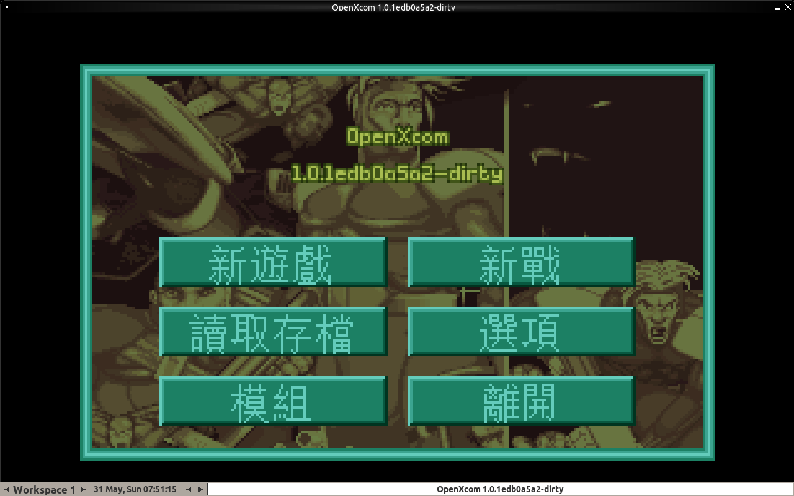 | 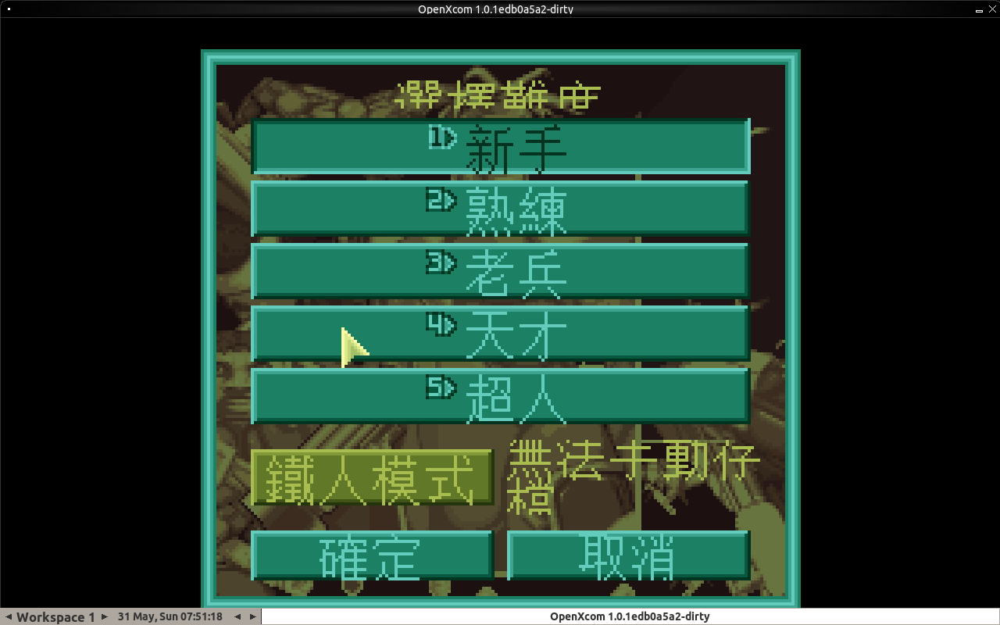 | 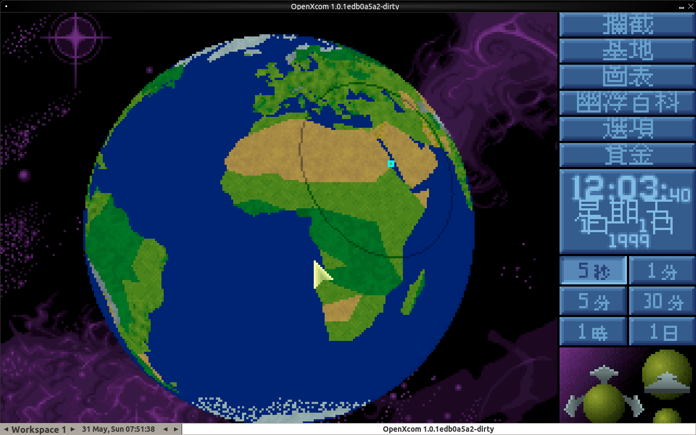 |

| Basescape | Geoscape Options | UFOpaedia |
|---|---|---|
| 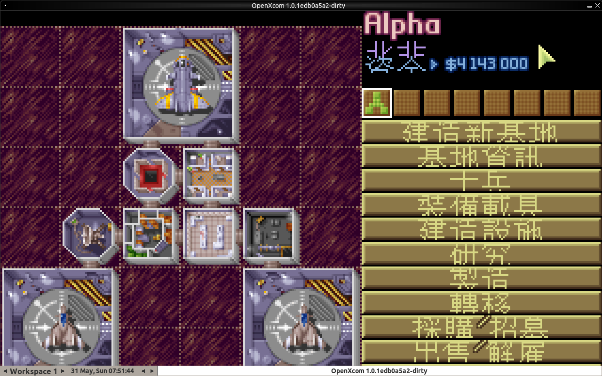 | 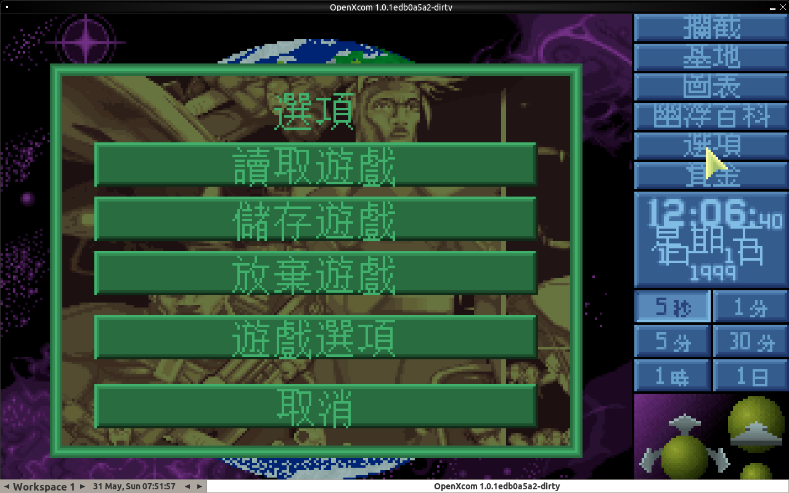 | 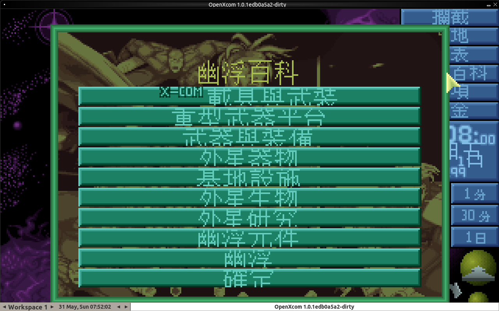 |

### 群組 C：字型 Before / After

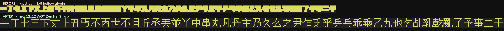
*上游 8×9 中空字 vs 本 patch 12×12 WQY Sharp embedded bitmap*

### 群組 D：UFOpaedia 文字色 v2.18（兩背景兩配色）

| UFOpedia 選單 | Skyranger 飛機介紹（天空） | Interceptor（紫天）|
|---|---|---|
| 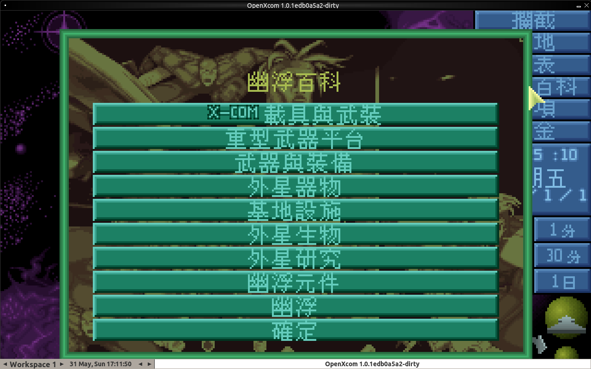 | 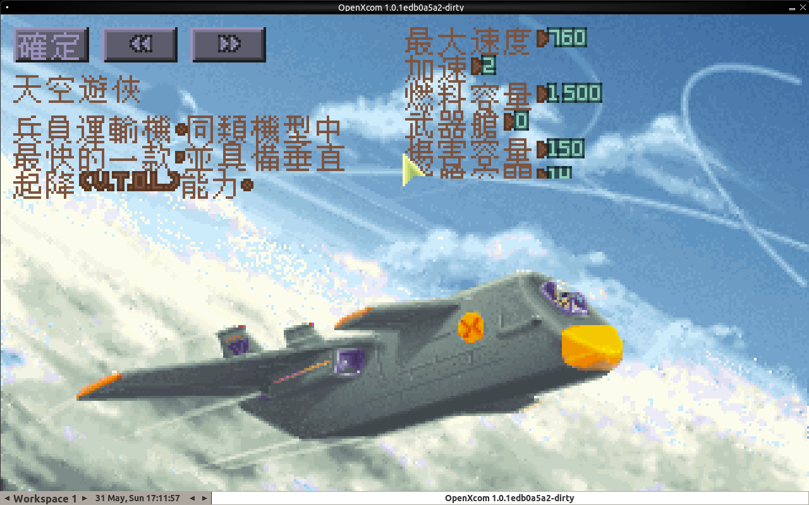 | 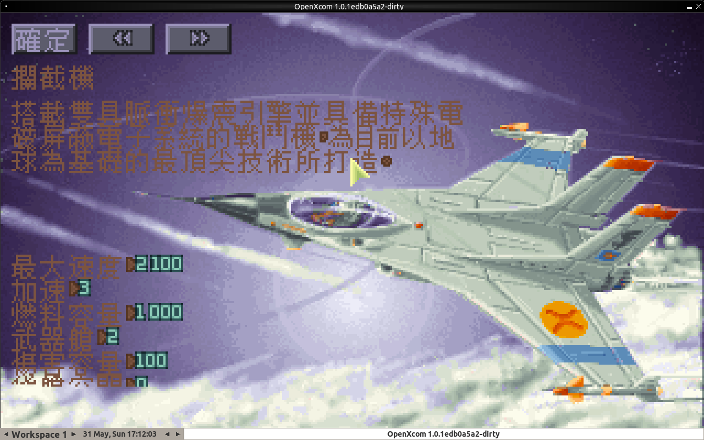 |

| 加農炮（黑底）| 武器介紹 |
|---|---|
| 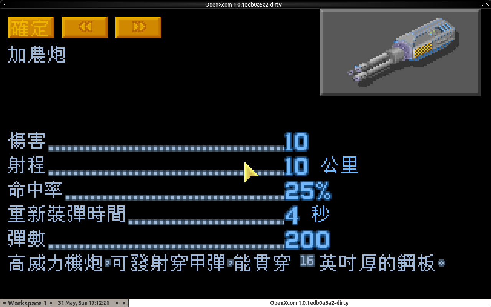 | 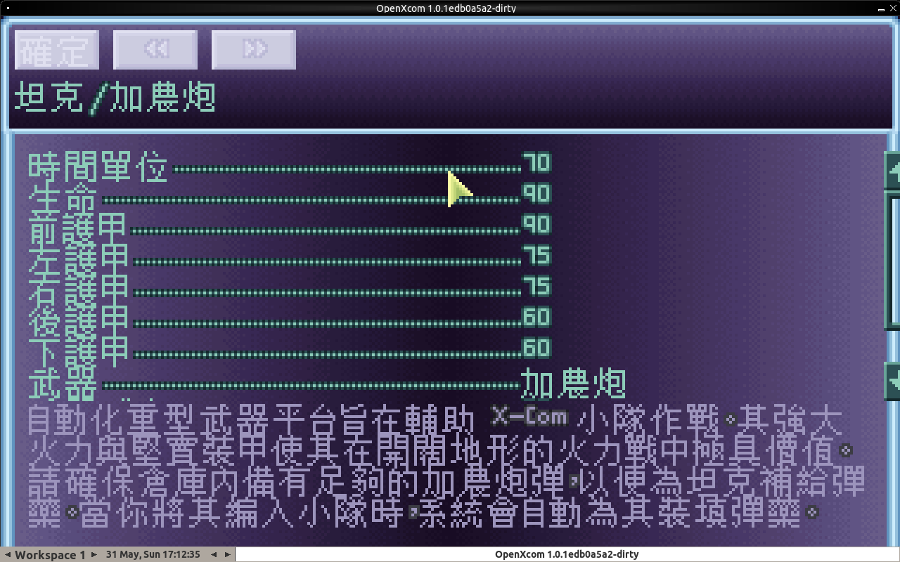 |

配色推導：
- 飛機 article（天空背景）：`blockOffset(14)+10`=**234** → ramp 235..239 deep brown `#7C5440..#503020` (L=93→55)
- 武器 article（黑底）：vanilla `blockOffset(14)+15`=**239** → ramp 240..244 light blue `#A0B8D8..#2C3C4C` (L=180→57)
- 根因：X-COM `Text::setColor()` 是 ramp 基底，真實顯示色落在 `[color+1..color+5]` — 見 [`docs/ux_color_v2_designer.md`](docs/ux_color_v2_designer.md)

---

<a name="pioneers-1994"></a>
## 🏛️ 1994 第三波中文化先行者

在這個專案之前，有一份 1994 年的台灣出版物為繁體中文世界奠定了 X-COM 的詞彙基礎。

### 第三波文化《幽浮１—地球防衛武力》遊戲手冊（1994，46 頁）

**出版**：第三波文化事業股份有限公司  
**編譯**：阮建成  
**原著**：MicroProse, _UFO: Enemy Unknown_  
**數位化**：DDSC (Documents Digitize Service Center), 2009-02-26

當年沒有攻略 App、沒有 Discord；台灣的第一批 X-COM 玩家就憑這本薄薄的中文手冊，走進一個 320×200 解析度的英文戰術世界。

**手冊收錄**：
- 主畫面/攔截/基地/統計/UFOPAEDIA/選項/補助/地面戰鬥 共 8 個畫面區段
- 200+ 條英中對照詞彙（按字母順序綜合列表）
- 涵蓋：兵種、軍階、飛行器、武器、設施、屬性、戰場行動、研究/製造、外星人

**關鍵譯名 32 年來繁中圈通用**：幽浮 / 攔截機 / 運兵機 / 電漿 / 心靈 / 收容所 / 指揮官 / 雪崩式飛彈 / 黃貂魚式飛彈。

### 與 1994 年手冊的詞彙決策對照

| 英文 | 1994 第三波 | 本專案 | 結論 |
|---|---|---|---|
| UFO | 幽浮 | **幽浮** | ✓ 沿用 1994 |
| UFOPAEDIA | 幽浮百科 | **幽浮百科** | ✓ 沿用 1994 |
| INTERCEPTOR | 攔截機 | **攔截機** | ✓ 沿用 1994 |
| PLASMA | 電漿 | **電漿** | ✓ 沿用 1994 — 32 年來繁中圈一致 |
| SKYRANGER | **運兵機** | 天空遊俠 | ⚠️ 1994 較佳，**後續版本待改回** |
| STINGRAY | **黃貂魚式飛彈** | 刺尾 | ⚠️ 1994 為正譯（魟魚），「刺尾」是誤譯 |
| MEDI-KIT | **醫藥箱** | 醫療包 | 雙方皆通 |
| BERSERK | 發狂 | 陷入狂暴 | 1994 較簡潔 |
| 軍階體系 | 兵 / 士官 / 尉官 / 校官 | 下士 / 中士 / 上尉 / 上校 | 現行更精確 |

完整 200+ 條譯名對照、衝突分析、修正候選見 [`docs/GLOSSARY_1994_MANUAL.md`](docs/GLOSSARY_1994_MANUAL.md)。

### 匿名 PDF 掃描者

這份 1994 紙本文獻得以在 2026 年仍能供我們查閱，全賴 DDSC 不知名的掃描者於 2009 年將其數位化保存。沒有他們，30 年後的漢化研究就只能憑空推測。原始 PDF 收錄於 [`docs/DDSC-J-00120-...pdf`](docs/)（30 MB，46 頁，非商業流傳）。

---

<a name="technical-deep-dive"></a>
## 🔧 Technical Deep Dive

### 翻譯策略：軍事公文體 + 1990 年代電玩翻譯味

X-COM 內介面用詞屬於**軍事行動報告**體例：簡短、被動、命令式。例如：

| 原文 | 太白（❌） | 太古（❌） | 採用（✓） |
|---|---|---|---|
| LAUNCH | 發射！| 啟航！| **派出** |
| READY | 準備好了 | 蓄勢待發 | **待命** |
| INTERCEPT | 攔截它 | 邀擊之 | **攔截** |
| INTERCEPTOR DAMAGED | 攔截機壞了 | 攔截機受創 | **攔截機受損** |
| HAS GONE BERSERK | 抓狂了 | 喪心病狂 | **陷入狂暴** |

### 5 個 Source Patches（最小化原則）

| Patch | 用途 |
|---|---|
| `Engine/Font.cpp:193` | `getHeight()` 取所有 image max height — 修 line step 不跟 per-image override |
| `Engine/Options.cpp:80-85` | 解鎖 `baseXResolution / baseYResolution` OptionInfo（options.cfg 可改 base resolution） |
| `Geoscape/GeoscapeState.cpp` | 時鐘 widget 改 `setSmall()`、Weekday 縮小、日期改西元「1999 / 1 / 1」 |
| `Ufopaedia/ArticleStateCraft.cpp` | 飛機 article 文字色 `blockOffset(14)+10` (234) — deep brown ramp 對天空 ✓ |
| `Ufopaedia/ArticleStateCraftWeapon.cpp` | 武器 article 維持 vanilla `+15` (239) — light blue ramp 對黑底 ✓ |
| `Menu/MainMenuState.{cpp,h}` | 主選單右下角加 chibi pixel art 簽名（48×24 paletted PNG）|

### 字型架構：12px 點陣 + per-image override

X-COM 原生字型 8×9（ASCII only）。直接放大全字型會破壞 vintage 視覺。本專案策略：

```yaml
# Font.dat
- id: FONT_SMALL
  width: 8           # global 預設保留 ASCII 大小
  height: 9
  spacing: -1
  images:
    - file: FontSmall.png         # 上游 ASCII，不動
      width: 8
      height: 9
    - file: FontSmall_zh-TW.png   # 我們的中文字
      width: 12        # per-image override
      height: 12
      spacing: 2       # 避免相鄰字 ink 黏
      chars: > ...     # 4 808 字
```

關鍵雷區：
- `FontGeoSmall_zh-TW.png` cell **不可降到 10** — Geoscape 右側選單（攔截/基地/圖表/…）共用這張字型，cell 10 會 clip 71 字
- 全局 height 9 不可改 12，否則 vanilla `FontSmall.png` 8×9 被當 8×12 slice → ASCII 字表錯位
- `spacing: 2` per-image override 解 ghost overlap（CJK ink 寬 = cell-1，相鄰會黏）

### Geoscape 時鐘 widget layout（CJK 11px vs ASCII 9px 行距取捨）

```cpp
// v2.17 final（GeoscapeState.cpp）
_txtHour->setSmall();      // 12:00:00 群組改用 8x9 ASCII font
_txtHourSep->setSmall();
_txtMin->setSmall();
_txtMin->setAlign(ALIGN_LEFT);
_txtWeekday = new Text(59, 12, screenWidth-61, screenHeight/2-15);
_txtYear  = new Text(59, 12, screenWidth-61, screenHeight/2-4);  // "1999 / 1 / 1"
_txtDay->setText(""); _txtMonth->setText("");                    // 合併到 Year widget
```

設計取捨：1994 原版時鐘是純 ASCII 緊湊 layout，CJK 全寬字撐破。妥協方案：時鐘行 (12:00:00) 用 ASCII 字體保留緊湊性，下一行 Weekday 用 CJK 12px，再下行用「西元 / 月 / 日」三段組合避免月日縮寫不通順。

### UFOpaedia 文字色 root-cause

```cpp
// src/Interface/Text.cpp:466 PaletteShift::func
dest_palette_index = color + src * mul    // src=font glyph AA pixel 1..5
```

**`color` 不是顯示色，是 ramp 基底**。真實像素落在 `[color+1..color+5]`。所以：
- vanilla 239 → 像素 240..244：PAL_UFOPAEDIA 是「淡奶油→灰」（淡色 ramp）對天空背景對比災難
- v1 嘗試 255 → 像素 0..4：idx 0 透明 + block 15 起點淡黃色 → 完全不可見
- v2.18 final = **234 deep brown ramp**（對天空）+ **239 light blue ramp**（對黑底）

完整推導見 [`docs/ux_color_v2_designer.md`](docs/ux_color_v2_designer.md)。

### 主選單簽名整合（v2.19）

```cpp
// MainMenuState.cpp
_sigBadge = new Surface(48, 24, 270, 174);  // base 320x200, 右下角
add(_sigBadge);                              // raw surface, 不走 interfaces.rul
_sigBadge->loadImage(FileMap::getFilePath("Resources/signature_pang.png"));
```

PNG 是 8bpp paletted，palette 對齊 PAL_GEOSCAPE（MainMenuState 使用的 palette），不需 remap。設計師 agent 用 GEOSCAPE block 14 橄欖→暗棕 + idx 32 亮綠（眼鏡點綴）共 8 個 palette idx。詳見 [`docs/signature_design.md`](docs/signature_design.md)。

### 驗證 pipeline

```bash
python3 tools/wsl_validate_translations.py    # YAML coverage + 簡體偵測
python3 tools/wsl_deep_validate.py            # format specifier / glossary
python3 tools/wsl_check_char_coverage.py      # 字型 cell list 涵蓋率
bash    tools/wsl_ship_gate.sh                # 跑全 3 + PASS/FAIL summary
```

Ship gate 3/3 PASS 條件：
- 0 missing chars / 0 真簡體 / 0 FMT_MISMATCH / 100% en key coverage

---

<a name="upstream"></a>
## ⬆️ Upstream & Patches

| 項目 | 來源 |
|---|---|
| **上游專案** | [github.com/OpenXcom/OpenXcom](https://github.com/OpenXcom/OpenXcom) (master) |
| **Fork 基準 commit** | `1edb0a5a`（2024-2025 era master） |
| **Upstream license** | GPL-3.0-or-later |
| **Patches 數量** | **5 個** `.cpp` + 1 PNG（最小化原則，全在 `patches/src/`） |
| **本地 build 位置** | `D:\openxcom\OpenXcom\`（含 v2.19 patched source） |

**本專案不 fork 上游、不 maintain 平行分支** — 只發佈 5 個獨立 patch 檔，任何人可在乾淨的 OpenXcom master clone 上覆蓋這 5 檔重新 build。

### 衍生工具

- [`tools/make_portable.ps1`](tools/make_portable.ps1) — Windows portable ZIP 一鍵打包
- [`tools/build_appimage.sh`](tools/build_appimage.sh) — Linux AppImage 一鍵打包（ldd analysis + XDG-compliant launcher）
- [`tools/make_fonts_zhtw.py`](tools/) — PIL + WQY 渲染 zh-TW 字型 PNG

---

<a name="cocomo"></a>
## 💰 開發成本估算（COCOMO SLOC 模型）

用經典 **COCOMO Basic**（`工作量 PM = a · KLOC^b`）反推「這套東西**用傳統方式**要投入多少人力」，再對照 **2026 AI-agent 工具棧**的實際投入。漢化專案的勞動是 widget pixel 級硬約束、機械化譯文堆疊、文獻學考據三件事的混合體，所以這裡拆 **3 個 sub-project** 分別套 COCOMO mode，比單一 KLOC 拍腦袋準得多。

完整盤點與重跑指令見 [`D:\openxcom\docs\cocomo_audit_v2_27.md`](../docs/cocomo_audit_v2_27.md)。

### 實測 SLOC（本專案實際產出）

| 類別 | 檔數 | 有效行 / KLOC |
|---|---:|---:|
| 程式碼（Python / PowerShell / Bash） | 13 | 902 |
| Source patches（C/C++，整檔 carry） | 18 | 7,038 |
| Source patches（effective change，抽樣 diff 估） | — | ~1,000 |
| 翻譯 YAML（common + xcom1 + xcom2，2,652 個 STR_ key） | 3 | 3,055 |
| Soldier 音譯 `.nam`（34 國） | 34 | 5,818 |
| Markdown 文件（README + 20 篇 docs / GLOSSARY） | 21 | 3,864（× 0.3 折 = 1,159 effective） |

### COCOMO Basic（3 sub-project 分軌）

| Sub-project | KLOC | Mode | 工作量 PM | 工期（月） | 並行人數 |
|---|---:|---|---:|---:|---:|
| 1. Source patches（effective change） | 1.00 | Embedded | 3.6 | 3.77 | 1.0 |
| 2. 翻譯 YAML + .nam | 8.87 | Organic | 23.7 | 8.33 | 2.85 |
| 3. 工具 + 文件 + 驗證 | 2.06 | Semi-detached | 6.7 | 4.87 | 1.38 |
| **加總** | **11.93** | — | **34.1** | — | — |

> 若把 patches 改用 full-carry 7.04 KLOC 計（含未動的 upstream 整檔備份），上界為 **67.9 PM ≈ 5.66 人年**。本表採 effective change，理由：那 6,000 行 upstream 程式碼不是「我們的勞動」。

### 為何這樣計算（方法論註解）

1. **為何拆 3 個 mode**：譯一條 `STR_` 跟重排一個 widget 是兩個世界的勞動。單一 KLOC × 單一 mode 會嚴重失真——這是 pg-cht 純逆向專案不會遇到的偏差，但漢化專案翻譯量過大時必須分軌。
2. **為何翻譯 YAML / `.nam` 列入 KLOC**：嚴格說 YAML 是資料不是程式，但漢化專案的人力主成本就壓在這上面（一條 STR 含 retro context 研究 → 譯出 → 過稿，平均 5-15 分鐘）。不列入會把整個專案低估到只剩 patches 與 tools，與實況嚴重不符。取捨：列入但用 Organic 係數（鬆耦合、機械重複最貼近譯文勞動）。
3. **Markdown 為何打 0.3 折**：`GLOSSARY_1994_MANUAL.md` 與 `tftd_knowledge_base_v2.md` 是有原始查證的考據文，但密度比寫程式 LOC 低。0.3 是業界 docs-as-code 常用折扣。
4. **COCOMO 在此類專案的系統性偏差**：
   - **低估**：逆向工程零成本假設（Font.cpp hook、`NUM_LANGUAGES` 都是從 source 反推）；像素級 widget 調整是「改 3 行、跑遊戲 10 次、確認沒蓋住、再改 3 行」的迭代不被建模
   - **高估**：COCOMO Basic 假設專業團隊（本專案是「1 個資深 + AI agent」，無溝通成本）；TDEV 公式對 1-2 人小團隊會把工期拉長 2-3x；機械重複工作（34 國音譯）可大量並行
5. **★ 2026 工具棧現實校正（本專案即為實測 spike）★**：實測 wall-clock 約 **10-15 天**，從 v1 ship 到 v2.27 含 TFTD 完整介入。槓桿三件事：
   - AI agent **並行**做（mass translation × 1 channel + widget audit × 1 channel + .nam 音譯 × 1 channel）
   - 使用者**主導 UX 測試**（截圖視覺判斷字粗、widget 重疊、ramp 飽和度）與設計決策
   - WSL Xvfb harness 把「跑遊戲確認沒爆」從 10 分鐘/次降到 30 秒/次

### 結論（三個數字並陳）

| 視角 | 人力 | 對應 wall-clock |
|---|---:|---|
| **COCOMO 教科書**（3 sub-project effective 加總） | **34.1 PM ≈ 2.84 人年** | 6-9 個月 |
| **傳統人力**（1 senior dev + 1 譯者，無 AI；COCOMO small-team 校正後砍 3-5x） | **6-12 PM** | 4-8 個月 |
| **2026 實測**（AI agent + 使用者主導 UX 測試） | **0.5-0.8 PM** | 10-15 天 |

> 一句話：用 COCOMO Basic 估出來「合理上界 34 PM ≈ 2.8 人年」是個 1990s 假想中、把翻譯也算 LOC 的軟體公司方案；2026 年單人 + AI agent 把同樣的東西在 10-15 天 ship，加速比 ~40-70x。主要槓桿不是「LLM 自動寫 code」——是**翻譯工作的大規模並行**與 **WSL harness 把回歸測試降到秒級**這兩個沉默的乘數。如果有人問我這年頭做漢化還能不能養活一個小團隊，我會說：先量這兩個乘數，再決定要不要開公司。
>
> SLOC 由 `*.py / *.ps1 / *.sh / *.cpp / *.h` 去空行去純註解行統計；YAML / `.nam` 按原始行數計（一行一條譯文）；Markdown × 0.3 折。完整重跑指令見 [`cocomo_audit_v2_27.md`](../docs/cocomo_audit_v2_27.md)。

---

<a name="credits"></a>
## 📜 License & Credits

| Component | License |
|---|---|
| OpenXcom 本體 + 5 source patches | GPL-3.0-or-later |
| zh-TW 翻譯 YAML | CC BY-SA 4.0（譯者 own work） |
| WQY Zen Hei Sharp（FontBig / Small / GeoSmall 來源） | Apache 2.0 / GPL 雙授權 |
| `signature_pang.png`（chibi 簽名）| CC BY-SA 4.0 |
| `tools/` Python / Bash / PowerShell scripts | MIT |
| 1994 第三波《幽浮１》手冊（`docs/DDSC-J-...pdf`）| 版權屬第三波文化 / MicroProse；非商業流傳，僅供翻譯參考 |
| X-COM 原始遊戲資料（`data/UFO/`）| MicroProse / 2K Games 版權；不在 GitHub repo 內 |

### 致謝

- **Julian Gollop**（1994 X-COM 原作設計）— 創造 turn-based 戰術 RPG 雙層架構的天才
- **SupSuper + OpenXcom 團隊** — 從零重寫 1994 遊戲邏輯，2009 至今 16 年持續維護
- **阮建成 / 第三波文化**（1994）— 為繁中圈奠定 X-COM 詞彙基礎
- **DDSC 匿名掃描者**（2009）— 保存 1994 手冊 PDF
- **文泉驛 WQY Zen Hei** — 提供 IP-safe 中文字型來源

### 開發歷程 / 設計 doc

詳見 `docs/`：

- [`GLOSSARY_1994_MANUAL.md`](docs/GLOSSARY_1994_MANUAL.md) — 1994 第三波官方手冊 vs 本專案譯名對照（200+ 條）
- [`GLOSSARY_1995_TFTD_MANUAL.md`](docs/GLOSSARY_1995_TFTD_MANUAL.md) — 1995 第三波 TFTD 手冊對照 + 5 條譯名警告（80+ 條）
- [`soldier_names_phase_a.md`](docs/soldier_names_phase_a.md) — 士兵名 Phase A 6 國 ~2400 entries 音譯 ship summary
- [`soldier_names_phase_b.md`](docs/soldier_names_phase_b.md) — 士兵名 Phase B 5 國 ~1100 entries (JP/KR/ES/PT/IT) ship summary
- [`widget_clip_audit.md`](docs/widget_clip_audit.md) — v2.21 widget 切字 audit (338 hits → 100 受害 widget → Top 10 worst offenders)
- [`widget_patches_v221.md`](docs/widget_patches_v221.md) — v2.21 widget 7 處實作 deviation 與決策
- [`widget_patches_v222.md`](docs/widget_patches_v222.md) — v2.22 BaseInfo/MonthlyReport/GeoscapeCraft 高風險 reflow 決策
- [`mod_i18n_v222.md`](docs/mod_i18n_v222.md) — v2.22 mod 列表中文化 (source patch + 42 keys 翻譯)
- [`soldier_names_phase_c_*.md`](docs/) — v2.22 Phase C 23 國 ship summary（batch 1-3 + Congolese + Polish）
- [`ux_color_v2_designer.md`](docs/ux_color_v2_designer.md) — UFOpaedia 文字色 v2 配色 root cause + palette dump 推導
- [`signature_design.md`](docs/signature_design.md) — 主選單作者簽名 chibi pixel art 設計說明
- [`v2_plan.md`](docs/v2_plan.md) — 4 階段路線圖（v2.1 → v2.4）
- [`v2_review.md`](docs/v2_review.md) — v2 全 round design review（1 356 keys）
- [`SHIP_FINAL_V212.md`](docs/SHIP_FINAL_V212.md) — v2.12 ship final report
- [`dev_round1_font_fix.md`](docs/dev_round1_font_fix.md) — Font ghost overlap 根因 re-diagnosis（不是 line step bug，是 image spacing:0）
- [`trans_v23_batch1.md`](docs/trans_v23_batch1.md) — v2.3 round 117 條 UFOpedia 補翻
- [`DDSC-J-00120-遊戲手冊：幽浮１－地球防衛武力.pdf`](docs/) — 1994 第三波官方繁中手冊原文（46 頁，30 MB；DDSC 數位化，非商業流傳）

### 參考

- [OpenXcom](https://github.com/OpenXcom/OpenXcom) — 上游
- [OpenXcom Extended (OXCE)](https://github.com/MeridianOXC/OpenXcom) — fork with hi-res mod support
- [文泉驛 Zen Hei](http://wenq.org/) — 字型來源
- **1994 第三波官方繁中手冊**（DDSC-J-00120）— 譯名歷史對照基準，見 [`docs/GLOSSARY_1994_MANUAL.md`](docs/GLOSSARY_1994_MANUAL.md)
- 完整 skill 細節：`~/.claude/skills/openxcom-cht/SKILL.md`（如果你也在用 Claude Code）

PR / issue welcome — 特別是 v2.27 之後的方向：1994 STINGRAY/SKYRANGER 兩條譯名回歸、其餘高頻畫面 widget 切字 audit、TFTD 任務 briefing 長段落校對、社群 mod 譯名統一。

---

> 「**指揮官**，X-COM 計畫的成敗，就交給您了。地球的命運懸於一線。」  
> *Commander, the fate of XCOM rests in your hands. Earth's destiny hangs by a thread.*
